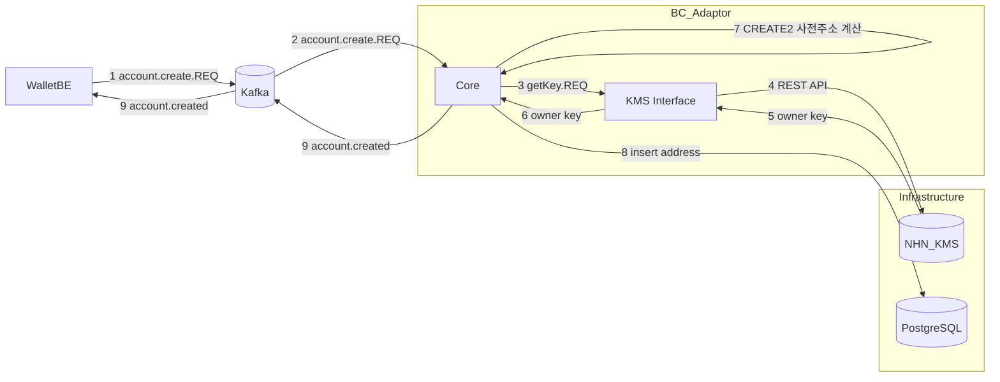
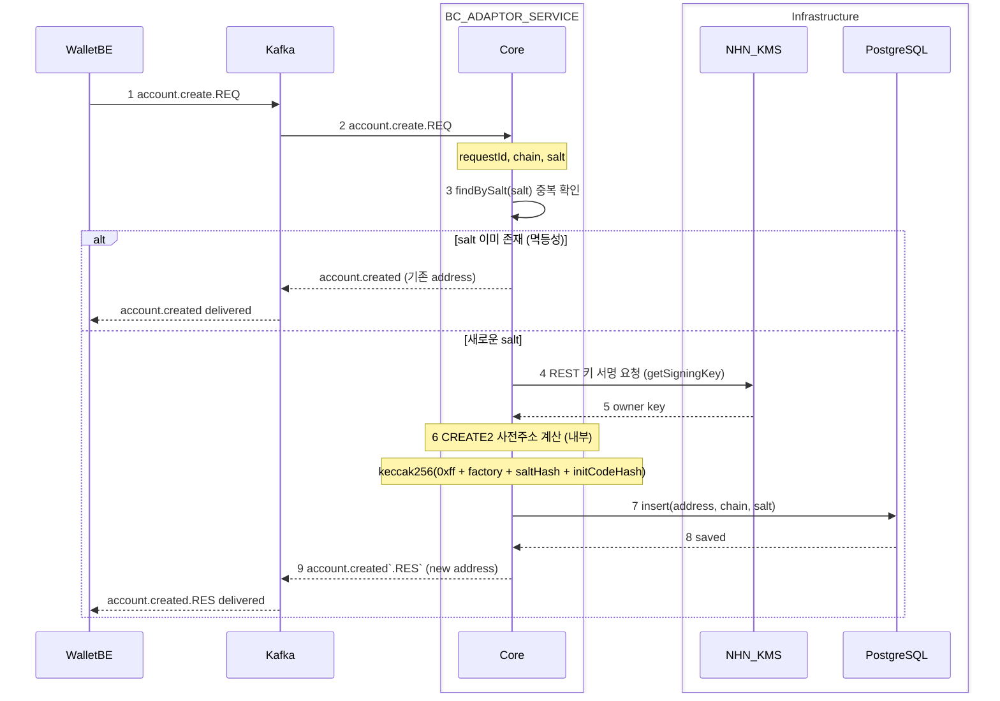
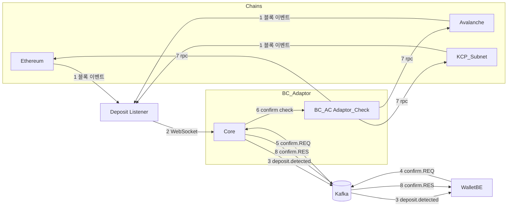
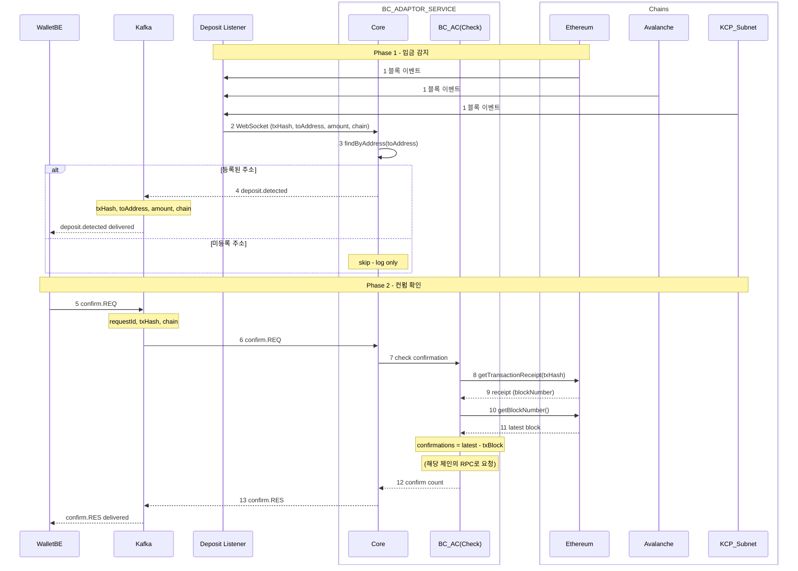

# BC_Adapter 유스케이스별 흐름 (Simplified View)

> Wallet Backend ↔ BC_Adaptor 간 외부 시스템 관점의 간략화된 흐름도

---

## 1. 첫 계정 생성 (Account Creation)

### Flowchart

### Sequence Diagram

---

## 2. 입금 (Deposit Detection + Confirmation)

### Flowchart

### Sequence Diagram

