# BC_Adapter Architecture Diagrams

> Wallet Backend ↔ EVM Blockchain Adapter — Hexagonal Architecture (Ports & Adapters)
> Persistence: Prisma + PostgreSQL

---

## 1. 전체 시스템 컨텍스트

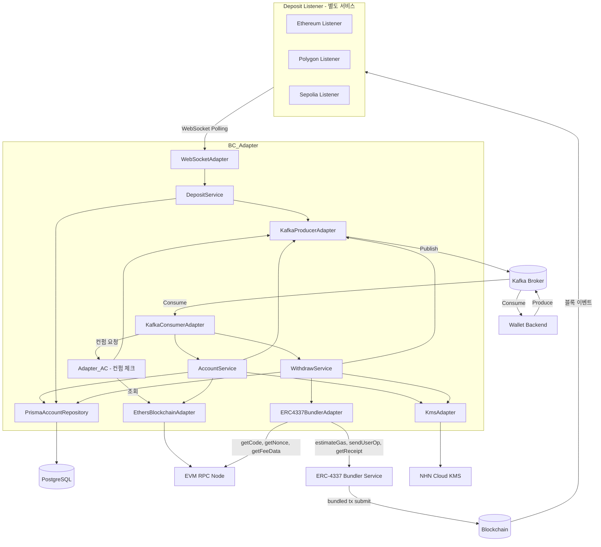

---

## 2. Hexagonal Architecture (레이어 구조)

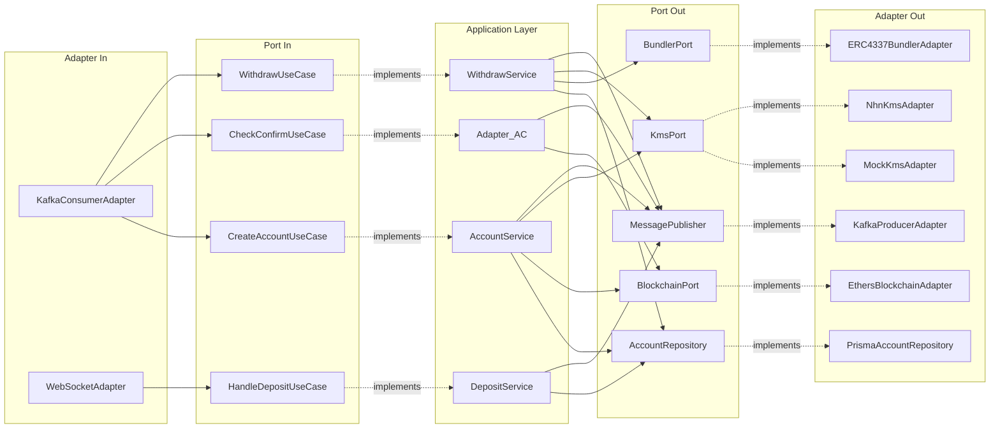

---

## 3. Kafka 메시지 흐름

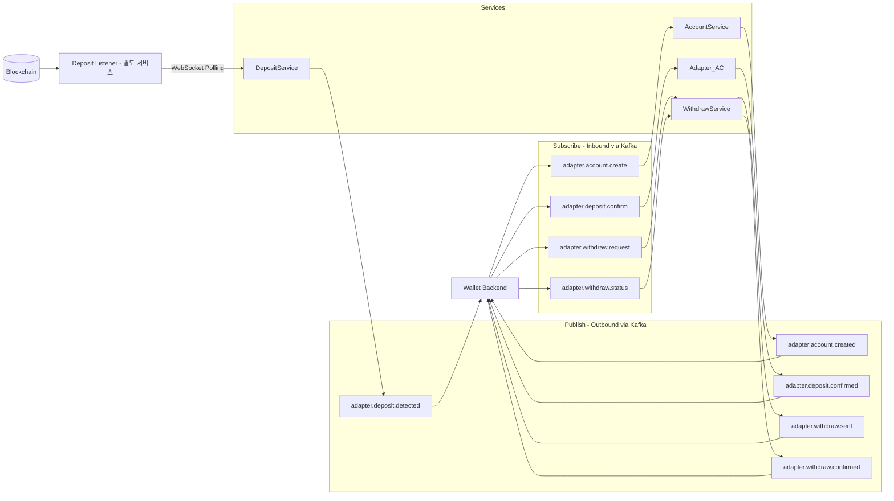

---

## 4. Account 생성 시퀀스

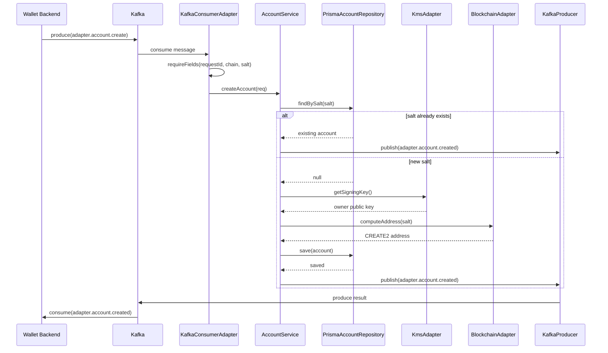

---

## 5. 입금 감지 및 확인 시퀀스

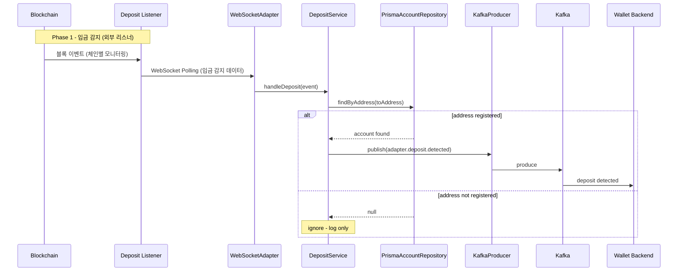

---

## 5-2. 컨펌 확인 시퀀스 (Adapter_AC)

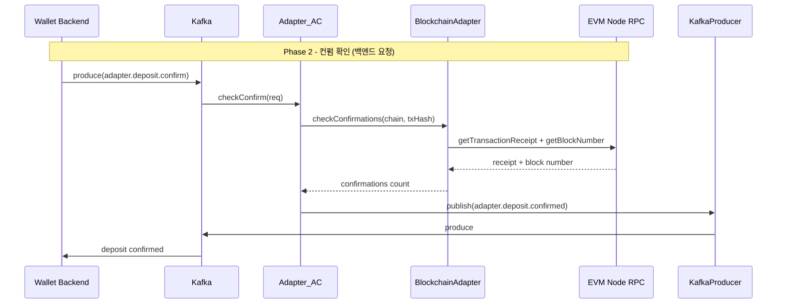

---

## 6. 출금 (ERC-4337) 시퀀스

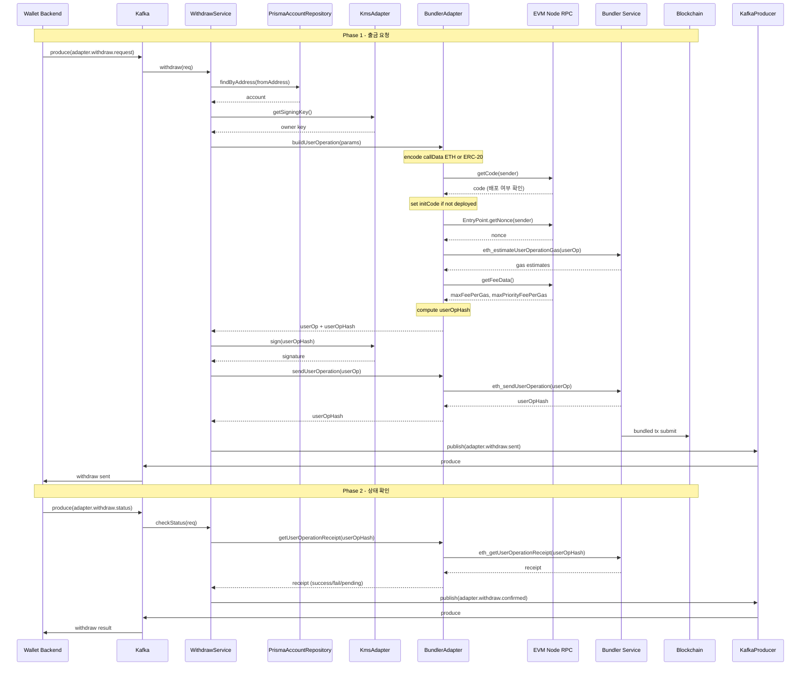

---

## 7. 에러 처리 흐름

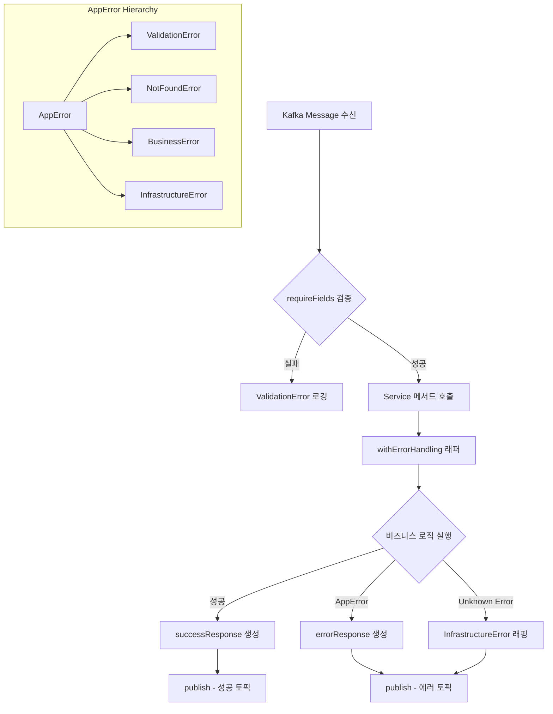

---

## 8. 클래스 다이어그램

```mermaid
classDiagram
    class Account {
        +string id
        +string address
        +string chain
        +string salt
        +DateTime createdAt
    }

    class UserOperation {
        +string sender
        +string nonce
        +string callData
        +string callGasLimit
        +string verificationGasLimit
        +string preVerificationGas
        +string maxFeePerGas
        +string maxPriorityFeePerGas
        +string signature
        +string initCode
        +string paymasterAndData
    }

    class CreateAccountUseCase {
        <<interface>>
        +createAccount(req) Promise
    }

    class HandleDepositUseCase {
        <<interface>>
        +handleDeposit(event) Promise
    }

    class CheckConfirmUseCase {
        <<interface>>
        +checkConfirm(req) Promise
    }

    class WithdrawUseCase {
        <<interface>>
        +withdraw(req) Promise
        +checkStatus(req) Promise
    }

    class AccountRepository {
        <<interface>>
        +save(account) Promise
        +findByAddress(address) Promise
        +findBySalt(salt) Promise
    }

    class BlockchainPort {
        <<interface>>
        +computeAddress(salt) Promise
        +checkConfirmations(chain, txHash) Promise
    }

    class BundlerPort {
        <<interface>>
        +buildUserOperation(params) Promise
        +sendUserOperation(userOp) Promise
        +getUserOperationReceipt(hash) Promise
    }

    class KmsPort {
        <<interface>>
        +getSigningKey() Promise
        +sign(data) Promise
    }

    class MessagePublisher {
        <<interface>>
        +publish(topic, payload) Promise
    }

    class AccountService {
        -AccountRepository accountRepo
        -KmsPort kms
        -BlockchainPort blockchain
        -MessagePublisher publisher
    }

    class DepositService {
        -AccountRepository accountRepo
        -MessagePublisher publisher
    }

    class Adapter_AC {
        -BlockchainPort blockchain
        -MessagePublisher publisher
    }

    class WithdrawService {
        -AccountRepository accountRepo
        -BundlerPort bundler
        -KmsPort kms
        -MessagePublisher publisher
    }

    class PrismaAccountRepository {
        -PrismaClient prisma
        +save(account) Promise
        +findByAddress(address) Promise
        +findBySalt(salt) Promise
    }

    AccountService ..|> CreateAccountUseCase
    DepositService ..|> HandleDepositUseCase
    Adapter_AC ..|> CheckConfirmUseCase
    WithdrawService ..|> WithdrawUseCase

    AccountService --> AccountRepository
    AccountService --> KmsPort
    AccountService --> BlockchainPort
    AccountService --> MessagePublisher

    DepositService --> AccountRepository
    DepositService --> MessagePublisher

    Adapter_AC --> BlockchainPort
    Adapter_AC --> MessagePublisher

    WithdrawService --> AccountRepository
    WithdrawService --> BundlerPort
    WithdrawService --> KmsPort
    WithdrawService --> MessagePublisher

    PrismaAccountRepository ..|> AccountRepository
```

---

## 9. Prisma 기반 Persistence 구조

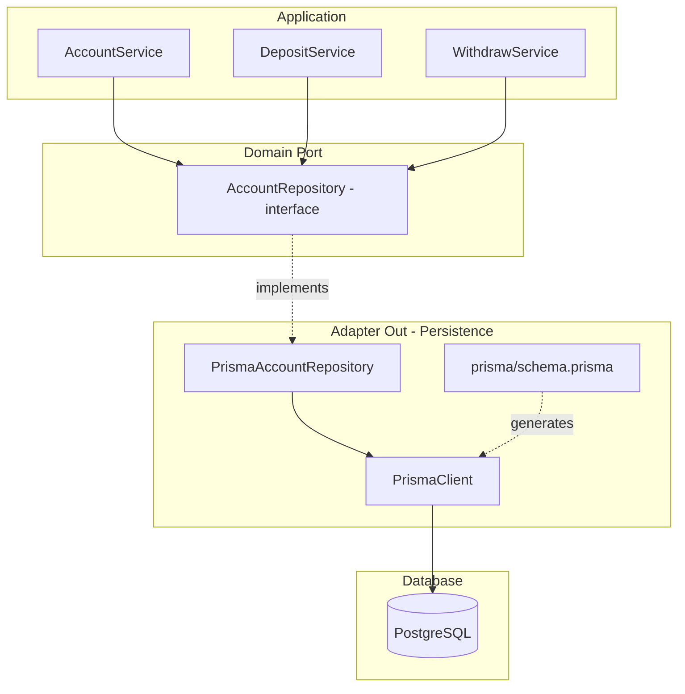

---

## 10. 디렉토리 구조

```mermaid
graph TD
    ROOT[src/] --> DOMAIN[domain/]
    ROOT --> APP[application/]
    ROOT --> ADAPTER[adapter/]
    ROOT --> CONFIG[config/]
    ROOT --> SHARED[shared/]
    ROOT --> ASYNC[asyncapi/]
    ROOT --> MAIN[app.ts]

    DOMAIN --> MODEL[model/]
    DOMAIN --> PORT[port/]
    MODEL --> ACC_M[Account.ts]
    MODEL --> UO_M[UserOperation.ts]
    PORT --> PIN[in/]
    PORT --> POUT[out/]
    PIN --> CAUC[CreateAccountUseCase.ts]
    PIN --> HDUC[HandleDepositUseCase.ts]
    PIN --> CCUC[CheckConfirmUseCase.ts]
    PIN --> WUC[WithdrawUseCase.ts]
    POUT --> AR[AccountRepository.ts]
    POUT --> BP[BlockchainPort.ts]
    POUT --> BUP[BundlerPort.ts]
    POUT --> KP[KmsPort.ts]
    POUT --> MP[MessagePublisher.ts]

    APP --> SUPPORT[support/]
    APP --> AS[AccountService.ts]
    APP --> DS[DepositService.ts]
    APP --> WS[WithdrawService.ts]
    SUPPORT --> WEH[withErrorHandling.ts]

    ADAPTER --> AIN[in/]
    ADAPTER --> AOUT[out/]
    AIN --> KAFKA_IN[kafka/KafkaConsumerAdapter.ts]
    AIN --> WS_IN[ws/WebSocketAdapter.ts]
    AOUT --> DB[persistence/]
    AOUT --> MSG[messaging/KafkaProducerAdapter.ts]
    AOUT --> BLOCK[blockchain/EthersBlockchainAdapter.ts]
    AOUT --> BUND[bundler/ERC4337BundlerAdapter.ts]
    AOUT --> KMS_OUT[kms/]
    DB --> SCHEMA[schema.prisma]
    DB --> REPO_IMPL[PrismaAccountRepository.ts]
    KMS_OUT --> MOCK[MockKmsAdapter.ts]
    KMS_OUT --> NHN[NhnKmsAdapter.ts]

    SHARED --> ERR[errors.ts]
    SHARED --> VAL[validation.ts]
    SHARED --> RES[response.ts]

    CONFIG --> CFG[index.ts]
    CONFIG --> DBCFG[database.ts]
    CONFIG --> KCFG[kafka.ts]
```

---

## 11. 유스케이스별 아키텍처

### 11-1. 첫 계정 생성 (Account Creation)

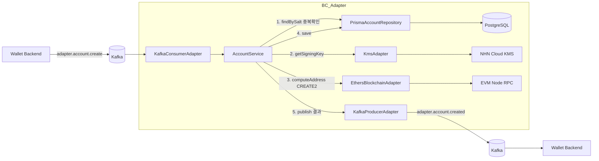

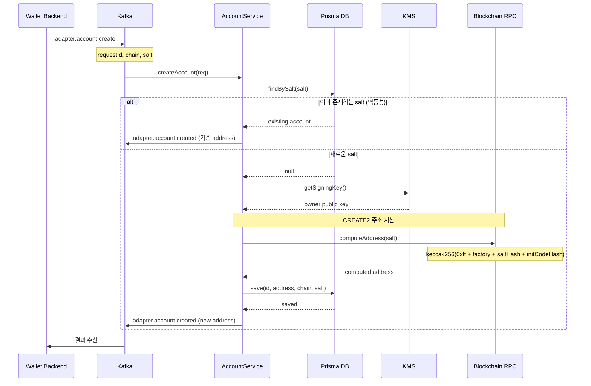

---

### 11-2. 입금 (Deposit Detection + Confirmation)

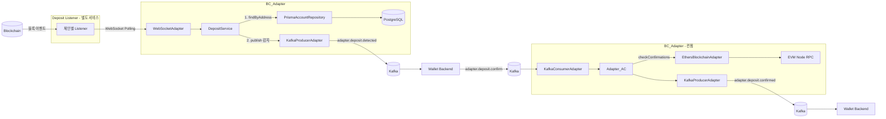

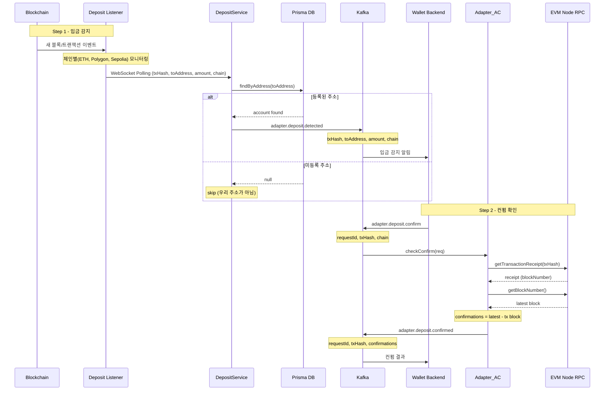

---

### 11-3. 출금 (Withdraw via ERC-4337)

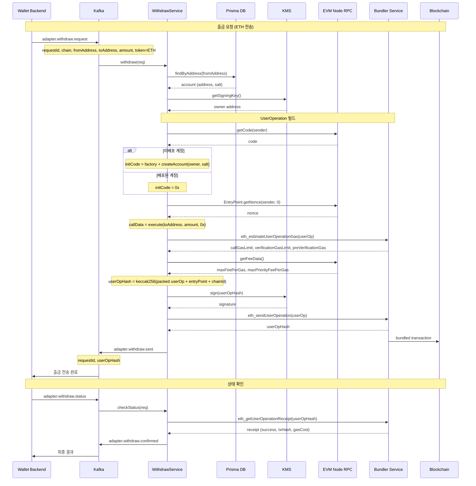

---

### 11-4. 결제 (Payment - ERC-20 토큰 전송)

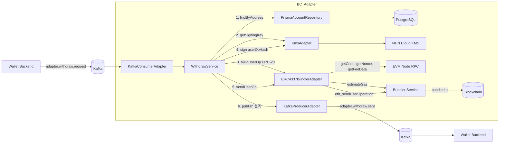

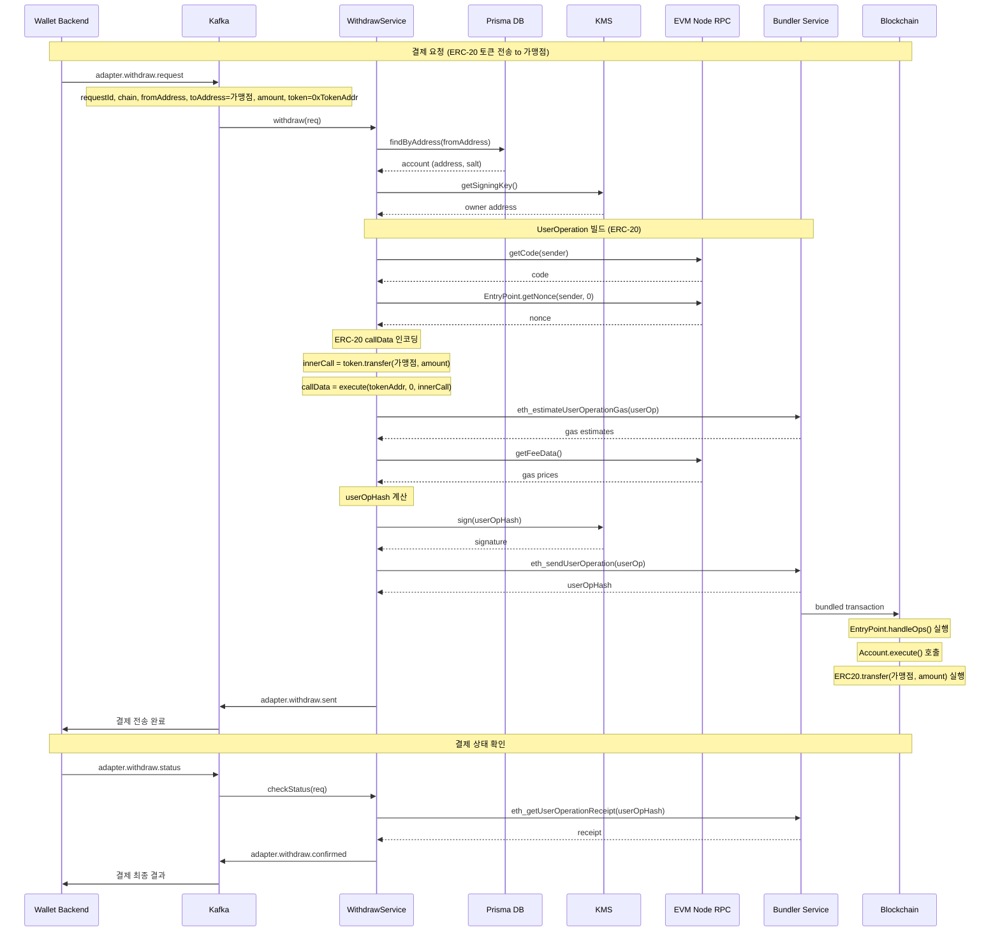
