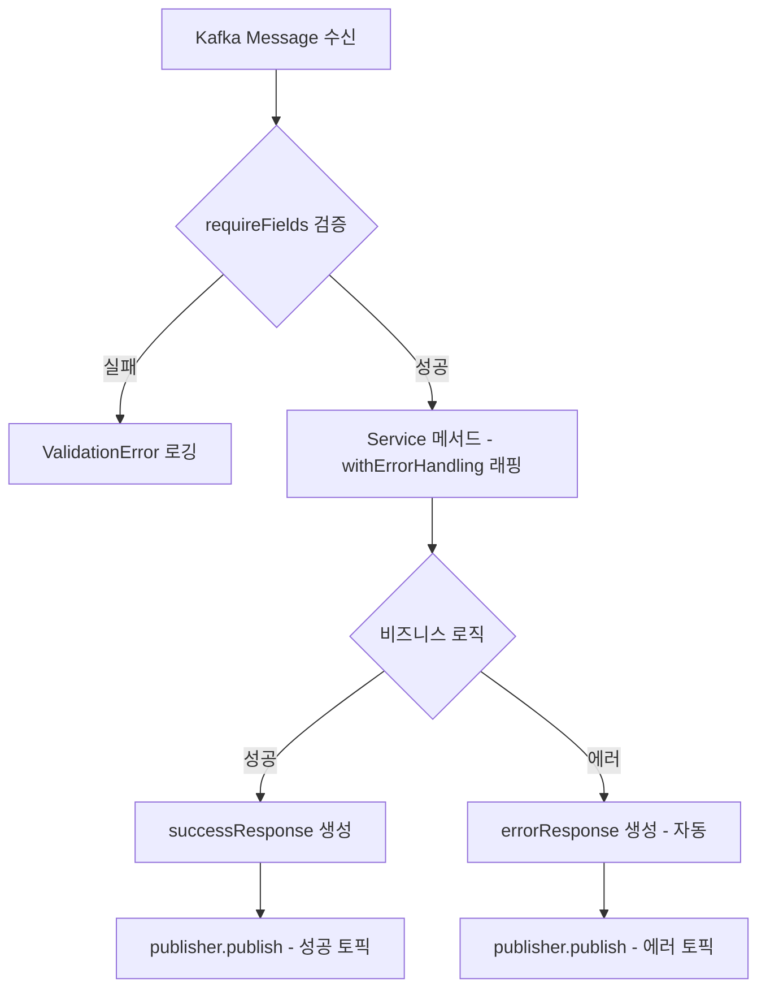

# BC Adapter 공통 모듈 설계서

| 항목 | 내용 |
|------|------|
| 시스템명 | BC Adapter (Blockchain Adapter) |
| 버전 | 1.0.0 |
| 작성일 | 2026-02-25 |
| 경로 | `src/shared/`, `src/application/support/`, `src/config/` |

---

## 목차

1. [에러 체계](#1-에러-체계)
2. [응답 규격](#2-응답-규격)
3. [입력 검증](#3-입력-검증)
4. [에러 핸들링 래퍼](#4-에러-핸들링-래퍼)
5. [Kafka 토픽 상수](#5-kafka-토픽-상수)
6. [체인 타입 및 검증](#6-체인-타입-및-검증)
7. [체인 Provider 레지스트리](#7-체인-provider-레지스트리)
8. [인프라 에러 래핑 유틸](#8-인프라-에러-래핑-유틸)
9. [Salt 해싱 유틸](#9-salt-해싱-유틸)
10. [주소 정규화](#10-주소-정규화)
11. [로거](#11-로거)
12. [Retry 유틸](#12-retry-유틸)
13. [Kafka 토픽 라우팅](#13-kafka-토픽-라우팅)
14. [AsyncAPI 데코레이터](#14-asyncapi-데코레이터)
15. [환경 설정](#15-환경-설정)
16. [DI 및 부트스트랩](#16-di-및-부트스트랩)
17. [공통 모듈 호출 흐름](#17-공통-모듈-호출-흐름)
18. [리팩토링 우선순위](#18-리팩토링-우선순위)

---

## 1. 에러 체계

| 항목 | 내용 |
|------|------|
| 파일 | `src/shared/errors.ts` |
| 용도 | 전체 시스템 공통 에러 코드 및 에러 클래스 정의 |

### 1.1 에러 코드 상수 (`ErrorCode`)

| 카테고리 | 에러 코드 | 설명 |
|----------|-----------|------|
| **Validation** | `VALIDATION_ERROR` | 일반 유효성 검증 실패 |
| | `MISSING_REQUIRED_FIELDS` | 필수 필드 누락 |
| | `UNSUPPORTED_CHAIN` | 지원하지 않는 체인 |
| **Not Found** | `NOT_FOUND` | 일반 리소스 미발견 |
| | `ACCOUNT_NOT_FOUND` | 계정 미등록 |
| **Infrastructure - KMS** | `KMS_KEY_RETRIEVAL_FAILED` | KMS 키 조회 실패 |
| | `KMS_SIGNING_FAILED` | KMS 서명 실패 |
| **Infrastructure - RPC** | `RPC_CONNECTION_FAILED` | 블록체인 RPC 연결 실패 |
| | `RPC_NOT_CONFIGURED` | 체인의 RPC URL 미설정 |
| **Infrastructure - Bundler** | `BUNDLER_BUILD_FAILED` | UserOperation 빌드 실패 |
| | `BUNDLER_SEND_FAILED` | UserOperation 전송 실패 |
| | `BUNDLER_RECEIPT_FAILED` | UserOperation 영수증 조회 실패 |
| | `BUNDLER_NOT_CONFIGURED` | 체인의 Bundler URL 미설정 |
| **Infrastructure - DB** | `DB_SAVE_FAILED` | 데이터베이스 저장 실패 |
| | `DB_QUERY_FAILED` | 데이터베이스 조회 실패 |
| **Infrastructure - Redis** | `NONCE_ACQUIRE_FAILED` | Redis nonce 획득 실패 |
| | `NONCE_RELEASE_FAILED` | Redis nonce 롤백 실패 |
| **Business** | `BUSINESS_ERROR` | 비즈니스 로직 에러 |
| **Unknown** | `UNKNOWN_ERROR` | 분류 불가 에러 |

### 1.2 에러 클래스 계층

```
AppError (base)
  ├── message: string
  └── code: string (ErrorCode)

├── ValidationError      → VALIDATION_ERROR, MISSING_REQUIRED_FIELDS, UNSUPPORTED_CHAIN
├── NotFoundError        → NOT_FOUND, ACCOUNT_NOT_FOUND
├── BusinessError        → BUSINESS_ERROR
└── InfrastructureError  → KMS_*, RPC_*, BUNDLER_*, DB_*, NONCE_*
```

### 1.3 사용 패턴

```typescript
// 커스텀 에러 코드로 throw
throw new ValidationError("Missing required fields: chain", ErrorCode.MISSING_REQUIRED_FIELDS);
throw new NotFoundError(`Account not found: ${address}`, ErrorCode.ACCOUNT_NOT_FOUND);
throw new InfrastructureError("RPC call failed", ErrorCode.RPC_CONNECTION_FAILED);

// catch 측에서 AppError 여부로 분기
if (err instanceof AppError) {
  // code, message 사용 가능
} else {
  // UNKNOWN_ERROR 처리
}
```

---

## 2. 응답 규격

| 항목 | 내용 |
|------|------|
| 파일 | `src/shared/response.ts` |
| 용도 | Kafka 응답 메시지의 성공/실패 형식 통일 |

### 2.1 `successResponse(requestId, data)`

```typescript
function successResponse(
  requestId: string,
  data: Record<string, unknown>,
): Record<string, unknown>
```

| 파라미터 | 타입 | 설명 |
|---------|------|------|
| requestId | string | 원본 요청의 추적 ID |
| data | Record<string, unknown> | 인터페이스별 응답 데이터 |

출력:

```json
{
  "requestId": "req-001",
  ...data
}
```

### 2.2 `errorResponse(requestId, err, extra?)`

```typescript
function errorResponse(
  requestId: string,
  err: unknown,
  extra?: Record<string, unknown>,
): Record<string, unknown>
```

| 파라미터 | 타입 | 설명 |
|---------|------|------|
| requestId | string | 원본 요청의 추적 ID |
| err | unknown | 에러 객체 |
| extra | Record<string, unknown> | 인터페이스별 추가 컨텍스트 (선택) |

출력:

```json
{
  "requestId": "req-001",
  "error": "에러 메시지",
  "errorCode": "ERROR_CODE",
  ...extra
}
```

- `err`이 `AppError`이면 `err.code`를 `errorCode`에 사용
- 그 외에는 `"UNKNOWN_ERROR"` 고정

### 2.3 인터페이스별 추가 컨텍스트

| 인터페이스 | extra 필드 | 용도 |
|-----------|-----------|------|
| 입금 컨펌 실패 | `{ txHash, status: "failed" }` | 어떤 트랜잭션이 실패했는지 식별 |
| 출금 상태 실패 | `{ userOpHash, status: "failed" }` | 어떤 UserOp이 실패했는지 식별 |

---

## 3. 입력 검증

| 항목 | 내용 |
|------|------|
| 파일 | `src/shared/validation.ts` |
| 용도 | Kafka 메시지 수신 시 필수 필드 검증 |

### 3.1 `requireFields(data, fields)`

```typescript
function requireFields(
  data: Record<string, unknown>,
  fields: string[],
): void
```

| 검증 조건 | 결과 |
|----------|------|
| 값이 `undefined` | `ValidationError` throw |
| 값이 `null` | `ValidationError` throw |
| 값이 `""` (빈 문자열) | `ValidationError` throw |
| 모든 필드 존재 | 통과 (void) |

에러 메시지 형식: `"Missing required fields: field1, field2"`

### 3.2 토픽별 필수 필드

| 토픽 | 필수 필드 |
|------|----------|
| `adapter.account.create` | requestId, chain, salt |
| `adapter.deposit.confirm` | requestId, txHash, chain |
| `adapter.withdraw.request` | requestId, chain, fromAddress, toAddress, amount, token |
| `adapter.withdraw.status` | requestId, chain, userOpHash |

---

## 4. 에러 핸들링 래퍼

| 항목 | 내용 |
|------|------|
| 파일 | `src/application/support/withErrorHandling.ts` |
| 용도 | 서비스 메서드를 감싸서 에러 발생 시 자동으로 Kafka에 에러 응답 발행 |

### 4.1 `withErrorHandling(publisher, options, fn)`

```typescript
function withErrorHandling<TReq>(
  publisher: MessagePublisher,
  options: WithErrorHandlingOptions<TReq>,
  fn: (req: TReq) => Promise<void>,
): (req: TReq) => Promise<void>
```

| 옵션 | 타입 | 설명 |
|------|------|------|
| topic | string | 에러 응답을 발행할 Kafka 토픽 |
| label | string | 로그 prefix (예: `"Account"`, `"Deposit"`) |
| getRequestId | `(req) => string` | 요청 객체에서 requestId 추출 |
| getErrorContext | `(req) => Record` | 에러 시 추가 컨텍스트 (선택) |

### 4.2 처리 흐름

```
fn(req) 실행
  ├── 성공 → 정상 종료 (서비스가 직접 publish)
  └── 에러 → catch
        ├── getRequestId(req) → requestId 추출
        ├── getErrorContext(req) → extra 추출
        ├── errorResponse(requestId, err, extra) → 에러 응답 생성
        └── publisher.publish(topic, errorResponse) → Kafka 발행
```

### 4.3 서비스별 적용 현황

| 서비스 | 메서드 | topic | label | errorContext |
|--------|--------|-------|-------|-------------|
| AccountService | createAccount | adapter.account.created | Account | - |
| DepositService | checkConfirm | adapter.deposit.confirmed | Deposit | `{ txHash, status: "failed" }` |
| WithdrawService | withdraw | adapter.withdraw.sent | Withdraw | - |
| WithdrawService | checkStatus | adapter.withdraw.confirmed | Withdraw | `{ userOpHash, status: "failed" }` |

---

## 5. Kafka 토픽 상수

| 항목 | 내용 |
|------|------|
| 파일 | `src/shared/topics.ts` (신규 추출 대상) |
| 현황 | 9개 토픽이 서비스 및 app.ts에 문자열 하드코딩 |
| 위험 | 오타 한 글자로 메시지 유실 가능, 컴파일 타임에 잡을 수 없음 |

### 5.1 토픽 정의

```typescript
export const Topics = {
  // Inbound (Subscribe)
  ACCOUNT_CREATE:     "adapter.account.create",
  DEPOSIT_CONFIRM:    "adapter.deposit.confirm",
  WITHDRAW_REQUEST:   "adapter.withdraw.request",
  WITHDRAW_STATUS:    "adapter.withdraw.status",

  // Outbound (Publish)
  ACCOUNT_CREATED:    "adapter.account.created",
  DEPOSIT_DETECTED:   "adapter.deposit.detected",
  DEPOSIT_CONFIRMED:  "adapter.deposit.confirmed",
  WITHDRAW_SENT:      "adapter.withdraw.sent",
  WITHDRAW_CONFIRMED: "adapter.withdraw.confirmed",
} as const;
```

### 5.2 현재 하드코딩 위치

| 위치 | 토픽 | 용도 |
|------|------|------|
| `app.ts:79` | `"adapter.account.create"` | Consumer 등록 |
| `app.ts:86` | `"adapter.deposit.confirm"` | Consumer 등록 |
| `app.ts:93` | `"adapter.withdraw.request"` | Consumer 등록 |
| `app.ts:107` | `"adapter.withdraw.status"` | Consumer 등록 |
| `AccountService.ts:24` | `"adapter.account.created"` | withErrorHandling topic |
| `AccountService.ts:35` | `"adapter.account.created"` | 성공 publish |
| `DepositService.ts:25` | `"adapter.deposit.confirmed"` | withErrorHandling topic |
| `DepositService.ts:41` | `"adapter.deposit.confirmed"` | 성공 publish |
| `DepositService.ts:61` | `"adapter.deposit.detected"` | 입금 감지 publish |
| `WithdrawService.ts:28` | `"adapter.withdraw.sent"` | withErrorHandling topic |
| `WithdrawService.ts:61` | `"adapter.withdraw.sent"` | 성공 publish |
| `WithdrawService.ts:75` | `"adapter.withdraw.confirmed"` | withErrorHandling topic |
| `WithdrawService.ts:90,100` | `"adapter.withdraw.confirmed"` | 성공 publish |

---

## 6. 체인 타입 및 검증

| 항목 | 내용 |
|------|------|
| 파일 | `src/shared/chain.ts` (신규 추출 대상) |
| 현황 | `Chain` 타입이 `asyncapi/messages/common.ts`에 정의되어 있으나 실제 코드에서 미사용. 서비스/어댑터 전부 `string` |
| 위험 | 런타임에 지원하지 않는 체인이 들어와도 검증 없이 진행되다가 Provider 조회 시점에서야 실패 |

### 6.1 타입 및 상수

```typescript
export type Chain = "ethereum" | "polygon" | "sepolia";

export const CHAIN_IDS: Record<Chain, number> = {
  ethereum: 1,
  polygon: 137,
  sepolia: 11155111,
};
```

### 6.2 검증 함수

```typescript
export function validateChain(chain: string): asserts chain is Chain {
  if (!(chain in CHAIN_IDS)) {
    throw new ValidationError(
      `Unsupported chain: ${chain}`,
      ErrorCode.UNSUPPORTED_CHAIN,
    );
  }
}
```

### 6.3 현재 chainId 조회 위치 (중복)

| 위치 | 코드 |
|------|------|
| `ERC4337BundlerAdapter.ts:243` | `getChainId()` — chainIds 하드코딩 |

공통 `CHAIN_IDS` 상수로 대체 대상.

---

## 7. 체인 Provider 레지스트리

| 항목 | 내용 |
|------|------|
| 파일 | `src/shared/ChainProviderRegistry.ts` (신규 추출 대상) |
| 현황 | 동일한 Provider 캐싱 패턴이 3군데 중복 |

### 7.1 중복 현황

| 위치 | 메서드 | 캐시 대상 |
|------|--------|----------|
| `EthersBlockchainAdapter.ts:64` | `getProvider(chain)` | RPC Provider |
| `ERC4337BundlerAdapter.ts:254` | `getBundlerProvider(chain)` | Bundler Provider |
| `ERC4337BundlerAdapter.ts:267` | `getNodeProvider(chain)` | RPC Provider |

### 7.2 공통 구현

```typescript
import { JsonRpcProvider } from "ethers";
import { InfrastructureError } from "./errors";

export class ChainProviderRegistry {
  private readonly providers = new Map<string, JsonRpcProvider>();

  constructor(
    private readonly urls: Record<string, string>,
    private readonly errorCode: string,
    private readonly label: string,
  ) {}

  get(chain: string): JsonRpcProvider {
    const existing = this.providers.get(chain);
    if (existing) return existing;

    const url = this.urls[chain];
    if (!url) {
      throw new InfrastructureError(
        `No ${this.label} URL configured for chain: ${chain}`,
        this.errorCode,
      );
    }

    const provider = new JsonRpcProvider(url);
    this.providers.set(chain, provider);
    return provider;
  }
}
```

### 7.3 적용 예시

```typescript
// EthersBlockchainAdapter
private readonly rpcProviders = new ChainProviderRegistry(
  config.rpcUrls, ErrorCode.RPC_NOT_CONFIGURED, "RPC"
);

// ERC4337BundlerAdapter
private readonly bundlerProviders = new ChainProviderRegistry(
  config.bundlerUrls, ErrorCode.BUNDLER_NOT_CONFIGURED, "Bundler"
);
private readonly nodeProviders = new ChainProviderRegistry(
  config.nodeRpcUrls, ErrorCode.RPC_NOT_CONFIGURED, "RPC"
);
```

---

## 8. 인프라 에러 래핑 유틸

| 항목 | 내용 |
|------|------|
| 파일 | `src/shared/errors.ts`에 추가 (신규 추출 대상) |
| 현황 | 4개 메서드에서 동일한 catch 블록 반복 |

### 8.1 중복 현황

| 위치 | ErrorCode |
|------|-----------|
| `EthersBlockchainAdapter.ts:55` | `RPC_CONNECTION_FAILED` |
| `ERC4337BundlerAdapter.ts:144` | `BUNDLER_BUILD_FAILED` |
| `ERC4337BundlerAdapter.ts:164` | `BUNDLER_SEND_FAILED` |
| `ERC4337BundlerAdapter.ts:193` | `BUNDLER_RECEIPT_FAILED` |

공통 패턴:

```typescript
catch (error) {
  if (error instanceof InfrastructureError) throw error;
  throw new InfrastructureError(
    `메시지: ${error instanceof Error ? error.message : String(error)}`,
    ErrorCode.XXX,
  );
}
```

### 8.2 공통 구현

```typescript
export function wrapInfraError(
  error: unknown,
  message: string,
  code: string,
): never {
  if (error instanceof AppError) throw error;
  throw new InfrastructureError(
    `${message}: ${error instanceof Error ? error.message : String(error)}`,
    code,
  );
}
```

### 8.3 적용 예시

```typescript
// Before
catch (error) {
  if (error instanceof InfrastructureError) throw error;
  throw new InfrastructureError(
    `Failed to build UserOperation: ${error instanceof Error ? error.message : String(error)}`,
    ErrorCode.BUNDLER_BUILD_FAILED,
  );
}

// After
catch (error) {
  wrapInfraError(error, "Failed to build UserOperation", ErrorCode.BUNDLER_BUILD_FAILED);
}
```

---

## 9. Salt 해싱 유틸

| 항목 | 내용 |
|------|------|
| 파일 | `src/shared/crypto.ts` (신규 추출 대상) |
| 현황 | 동일한 salt 해싱 코드가 2군데 중복 |

### 9.1 중복 현황

| 위치 | 코드 |
|------|------|
| `EthersBlockchainAdapter.ts:21` | `keccak256(AbiCoder.defaultAbiCoder().encode(["string"], [salt]))` |
| `ERC4337BundlerAdapter.ts:88` | `keccak256(AbiCoder.defaultAbiCoder().encode(["string"], [salt]))` |

### 9.2 공통 구현

```typescript
import { keccak256, AbiCoder } from "ethers";

export function hashSalt(salt: string): string {
  return keccak256(
    AbiCoder.defaultAbiCoder().encode(["string"], [salt]),
  );
}
```

---

## 10. 주소 정규화

| 항목 | 내용 |
|------|------|
| 파일 | `src/shared/address.ts` (신규 추출 대상) |
| 현황 | 주소 정규화(lowercase)가 일관성 없이 적용 |

### 10.1 불일치 현황

| 위치 | 정규화 여부 |
|------|-----------|
| `DepositService.ts:52` | `toAddress.toLowerCase()` — O |
| `WithdrawService.ts:35` | `fromAddress` 그대로 — X |

### 10.2 공통 구현

```typescript
export function normalizeAddress(address: string): string {
  return address.toLowerCase();
}
```

적용 방안:
- Repository의 `findByAddress()` 내부에서 항상 정규화 처리
- 또는 서비스 진입점에서 `normalizeAddress()` 호출 통일

---

## 11. 로거

| 항목 | 내용 |
|------|------|
| 파일 | `src/shared/logger.ts` (신규 추출 대상) |
| 현황 | `console.log/error` + prefix 패턴 직접 사용 |

### 11.1 현재 로깅 컨벤션

| prefix | 위치 |
|--------|------|
| `[App]` | `app.ts` — 부트스트랩, 셧다운 |
| `[Kafka]` | `KafkaConsumerAdapter.ts`, `KafkaProducerAdapter.ts` |
| `[WS]` | `WebSocketAdapter.ts` |
| `[Account]` | `AccountService.ts` |
| `[Deposit]` | `DepositService.ts` |
| `[Withdraw]` | `WithdrawService.ts` |

### 11.2 공통 구현

```typescript
export function createLogger(label: string) {
  return {
    info: (msg: string, data?: unknown) =>
      console.log(`[${label}] ${msg}`, data ?? ""),
    warn: (msg: string, data?: unknown) =>
      console.warn(`[${label}] ${msg}`, data ?? ""),
    error: (msg: string, err?: unknown) =>
      console.error(`[${label}] ${msg}`, err ?? ""),
  };
}

// 사용 예시
const logger = createLogger("Account");
logger.info(`Created: ${address} on ${chain}`);
logger.error("createAccount failed:", err);
```

운영 환경 전환 시 이 한 곳만 winston/pino로 교체하면 전체 적용 가능.

---

## 12. Retry 유틸

| 항목 | 내용 |
|------|------|
| 파일 | `src/shared/retry.ts` (신규 추출 대상) |
| 현황 | RPC, Bundler, KMS 등 외부 호출이 전부 1회 시도 후 실패 throw |
| 배경 | 블록체인 RPC는 일시적 실패(타임아웃, 레이트리밋)가 빈번 |

### 12.1 공통 구현

```typescript
export async function withRetry<T>(
  fn: () => Promise<T>,
  opts: { retries?: number; delay?: number; label?: string } = {},
): Promise<T> {
  const { retries = 3, delay = 1000, label = "retry" } = opts;

  let lastError: unknown;
  for (let attempt = 1; attempt <= retries; attempt++) {
    try {
      return await fn();
    } catch (err) {
      lastError = err;
      if (attempt < retries) {
        console.warn(`[${label}] Attempt ${attempt}/${retries} failed, retrying in ${delay}ms...`);
        await new Promise((r) => setTimeout(r, delay * attempt));
      }
    }
  }
  throw lastError;
}
```

### 12.2 적용 대상

| 어댑터 | 메서드 | 사유 |
|--------|--------|------|
| EthersBlockchainAdapter | `checkConfirmations` | RPC 일시 장애 |
| ERC4337BundlerAdapter | `buildUserOperation` | RPC + Bundler 복합 호출 |
| ERC4337BundlerAdapter | `sendUserOperation` | Bundler 일시 장애 |
| ERC4337BundlerAdapter | `getUserOperationReceipt` | Bundler 일시 장애 |
| NhnKmsAdapter | `getSigningKey`, `sign` | KMS API 일시 장애 |

### 12.3 Retry 정책 (권장)

| 대상 | 최대 재시도 | 대기 간격 | 비고 |
|------|-----------|----------|------|
| RPC 호출 | 3회 | 1초 × attempt | exponential backoff |
| Bundler 호출 | 3회 | 1초 × attempt | exponential backoff |
| KMS 호출 | 2회 | 500ms × attempt | 서명 키 조회는 빠른 실패 선호 |

---

## 13. Kafka 토픽 라우팅

| 항목 | 내용 |
|------|------|
| 파일 | `src/adapter/in/kafka/KafkaConsumerAdapter.ts` |
| 용도 | 토픽별 핸들러 등록 및 메시지 디스패치 |

### 13.1 등록-디스패치 패턴

```
register(topic, handler)  →  Map<topic, handler>에 저장
start()                   →  모든 토픽 subscribe → eachMessage에서 topic별 dispatch
```

### 13.2 토픽-핸들러 매핑

| 토픽 | 핸들러 | 서비스 |
|------|--------|--------|
| `adapter.account.create` | `accountService.createAccount` | AccountService |
| `adapter.deposit.confirm` | `depositService.checkConfirm` | DepositService |
| `adapter.withdraw.request` | `withdrawService.withdraw` | WithdrawService |
| `adapter.withdraw.status` | `withdrawService.checkStatus` | WithdrawService |

### 13.3 Consumer 에러 처리

| 에러 타입 | 처리 |
|----------|------|
| `AppError` | `[Kafka] {에러명} [{에러코드}] on {토픽}: {메시지}` 로깅 |
| 기타 | `[Kafka] Unexpected error processing {토픽}:` 로깅 |

에러 발생 시에도 Consumer는 중단되지 않고 다음 메시지를 계속 처리합니다.

---

## 14. AsyncAPI 데코레이터

| 항목 | 내용 |
|------|------|
| 파일 | `src/asyncapi/decorators.ts` |
| 용도 | Kafka 채널 메타데이터 선언 (런타임 no-op, 문서화 용도) |

### 14.1 데코레이터 목록

| 데코레이터 | 대상 | 설명 |
|-----------|------|------|
| `@AsyncApi(opts)` | 클래스 | API 루트 메타데이터 (title, version, server) |
| `@Subscribe(opts)` | 메서드 | Inbound 채널 — 외부에서 받는 메시지 (Kafka consume) |
| `@Publish(opts)` | 메서드 | Outbound 채널 — 외부로 보내는 메시지 (Kafka produce) |

### 14.2 옵션

| 필드 | 타입 | 설명 |
|------|------|------|
| channel | string | Kafka 토픽명 |
| operationId | string | 오퍼레이션 식별자 |
| summary | string | 간단 설명 |
| description | string | 상세 설명 |

런타임에는 아무 동작도 하지 않습니다. 코드 가독성 및 AsyncAPI 문서 생성용입니다.

---

## 15. 환경 설정

| 항목 | 내용 |
|------|------|
| 파일 | `src/config/index.ts`, `src/config/database.ts`, `src/config/kafka.ts` |
| 용도 | 환경변수 로드, 검증, 설정 객체 구성 |

### 15.1 설정 그룹

| 그룹 | 항목 | 환경변수 | 필수 | 기본값 |
|------|------|---------|------|--------|
| **db** | host | `DB_HOST` | O | - |
| | port | `DB_PORT` | - | 5432 |
| | username | `DB_USERNAME` | O | - |
| | password | `DB_PASSWORD` | O | - |
| | database | `DB_DATABASE` | O | - |
| **kafka** | brokers | `KAFKA_BROKERS` | O | - |
| | clientId | `KAFKA_CLIENT_ID` | - | `bc-adapter` |
| | groupId | `KAFKA_GROUP_ID` | - | `bc-adapter-group` |
| **rpc** | ethereum | `ETH_RPC_URL` | - | `""` |
| | polygon | `POLYGON_RPC_URL` | - | `""` |
| | sepolia | `SEPOLIA_RPC_URL` | - | `""` |
| **blockchain** | requiredConfirmations | `REQUIRED_CONFIRMATIONS` | - | 12 |
| | factoryAddress | `CREATE2_FACTORY_ADDRESS` | O | - |
| | initCodeHash | `CREATE2_INIT_CODE_HASH` | O | - |
| **kms** | appKey | `NHN_KMS_APP_KEY` | 조건부 | - |
| | secretKey | `NHN_KMS_SECRET_KEY` | 조건부 | - |
| | keyId | `NHN_KMS_KEY_ID` | 조건부 | - |
| | endpoint | `NHN_KMS_ENDPOINT` | 조건부 | - |
| **bundler** | ethereum | `ETH_BUNDLER_URL` | - | `""` |
| | polygon | `POLYGON_BUNDLER_URL` | - | `""` |
| | sepolia | `SEPOLIA_BUNDLER_URL` | - | `""` |
| | entryPointAddress | `ENTRY_POINT_ADDRESS` | O | - |
| | accountFactoryAddress | `ACCOUNT_FACTORY_ADDRESS` | O | - |
| **ws** | port | `WS_PORT` | - | 8080 |

KMS 설정은 `USE_MOCK_KMS=true`이면 빈 값 허용, 그 외에는 전부 필수.

### 15.2 필수 환경변수 검증

```typescript
function required(key: string): string {
  const value = process.env[key];
  if (!value) throw new Error(`Missing env variable: ${key}`);
  return value;
}
```

앱 시작 시 필수 환경변수가 누락되면 즉시 `Error`와 함께 종료됩니다.

---

## 16. DI 및 부트스트랩

| 항목 | 내용 |
|------|------|
| 파일 | `src/app.ts` |
| 패턴 | 수동 생성자 주입 (DI 프레임워크 미사용) |

### 16.1 부트스트랩 순서

```
1. DB 연결             → AppDataSource.initialize()
2. Outbound 어댑터 생성 → Repository, Producer, Blockchain, KMS, Bundler
3. Application 서비스   → 각 서비스에 Outbound 어댑터 주입
4. Inbound 어댑터       → KafkaConsumer에 토픽-핸들러 등록, WebSocket 시작
```

### 16.2 의존성 주입 구조

```
KafkaConsumerAdapter ─→ AccountService ─→ AccountRepository
                                        ─→ KmsPort
                                        ─→ BlockchainPort
                                        ─→ MessagePublisher

                     ─→ DepositService ─→ AccountRepository
                                        ─→ BlockchainPort
                                        ─→ MessagePublisher

                     ─→ WithdrawService ─→ AccountRepository
                                         ─→ BundlerPort
                                         ─→ KmsPort
                                         ─→ MessagePublisher

WebSocketAdapter ────→ DepositService (handleDeposit)
```

### 16.3 Graceful Shutdown

```
SIGINT / SIGTERM 수신
  → WebSocket 서버 종료
  → Kafka Consumer 연결 해제
  → Kafka Producer 연결 해제
  → DB 연결 해제
  → process.exit(0)
```

---

## 17. 공통 모듈 호출 흐름

모든 Kafka 기반 유스케이스가 따르는 공통 처리 흐름:

```
[Kafka Message 수신]
    │
    ▼
requireFields()              ← src/shared/validation.ts
    │ 실패 → ValidationError 로깅 (Consumer에서 catch)
    │
    ▼
Service 메서드 실행
    │ (withErrorHandling 래퍼 적용)
    │
    ├── 성공
    │   └── successResponse(requestId, data)    ← src/shared/response.ts
    │       └── publisher.publish(topic, response)
    │
    └── 에러
        └── errorResponse(requestId, err, extra) ← src/shared/response.ts
            └── publisher.publish(topic, response) ← withErrorHandling 자동 처리
```



---

## 18. 리팩토링 우선순위

코드 분석 결과 식별된 공통화 대상 및 우선순위입니다.

### 우선순위 높음

| 모듈 | 사유 | 현재 위험 |
|------|------|----------|
| [Kafka 토픽 상수](#5-kafka-토픽-상수) | 9개 토픽이 13곳에 문자열 하드코딩 | 오타 시 메시지 유실, 컴파일 타임 검출 불가 |
| [인프라 에러 래핑](#8-인프라-에러-래핑-유틸) | 4개 메서드에서 동일한 catch 블록 | 코드 중복, 에러 처리 불일치 가능 |
| [체인 타입 및 검증](#6-체인-타입-및-검증) | 전부 `string` 타입, 런타임 검증 없음 | 잘못된 체인이 Provider 조회 시점까지 진행 |

### 우선순위 중간

| 모듈 | 사유 | 현재 위험 |
|------|------|----------|
| [체인 Provider 레지스트리](#7-체인-provider-레지스트리) | 동일 패턴 3중 중복 | 동작 문제 없으나 유지보수 비용 |
| [Salt 해싱](#9-salt-해싱-유틸) | 동일 코드 2군데 | 해싱 로직 변경 시 한 곳 누락 가능 |
| [주소 정규화](#10-주소-정규화) | 일관성 깨져 있음 | 대소문자 불일치로 계정 조회 실패 가능 |

### 우선순위 낮음

| 모듈 | 사유 | 비고 |
|------|------|------|
| [로거](#11-로거) | console로도 당장 동작 | 운영 배포 전 교체 권장 |
| [Retry](#12-retry-유틸) | 외부 호출 1회 시도만 함 | 정책 설계 필요 (어디까지 retry?) |

### 신규 공통 파일 요약

| 파일 | 분류 | 내용 |
|------|------|------|
| `src/shared/topics.ts` | 신규 | Kafka 토픽 상수 |
| `src/shared/chain.ts` | 신규 | Chain 타입, CHAIN_IDS, validateChain |
| `src/shared/ChainProviderRegistry.ts` | 신규 | Provider 캐싱 공통 클래스 |
| `src/shared/crypto.ts` | 신규 | hashSalt 유틸 |
| `src/shared/address.ts` | 신규 | normalizeAddress 유틸 |
| `src/shared/logger.ts` | 신규 | createLogger 팩토리 |
| `src/shared/retry.ts` | 신규 | withRetry 유틸 |
| `src/shared/errors.ts` | 수정 | wrapInfraError 함수 추가 |
