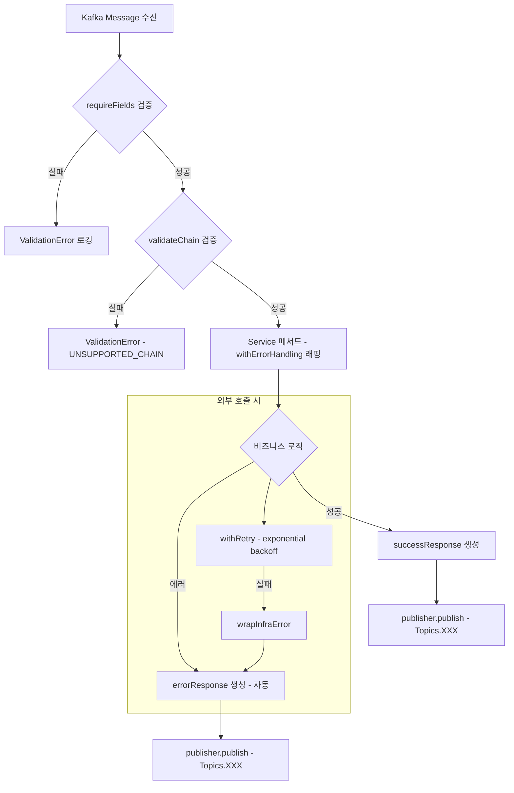

# BC Adapter 공통 모듈 설계서

| 항목 | 내용 |
|------|------|
| 시스템명 | BC Adapter (Blockchain Adapter) |
| 버전 | 1.1.0 |
| 작성일 | 2026-02-26 |
| 경로 | `src/shared/`, `src/application/support/`, `src/config/` |

---

## 목차

### A. 에러 / 응답 / 검증

1. [에러 체계](#1-에러-체계)
2. [인프라 에러 래핑 유틸](#2-인프라-에러-래핑-유틸)
3. [응답 규격](#3-응답-규격)
4. [입력 검증](#4-입력-검증)
5. [에러 핸들링 래퍼](#5-에러-핸들링-래퍼)

### B. 블록체인 유틸리티

6. [체인 타입 및 검증](#6-체인-타입-및-검증)
7. [체인 Provider 레지스트리](#7-체인-provider-레지스트리)
8. [Salt 해싱 유틸](#8-salt-해싱-유틸)
9. [주소 정규화](#9-주소-정규화)

### C. 메시징

10. [Kafka 토픽 상수](#10-kafka-토픽-상수)
11. [Kafka 토픽 라우팅](#11-kafka-토픽-라우팅)
12. [AsyncAPI 데코레이터](#12-asyncapi-데코레이터)

### D. 인프라 공통

13. [로거](#13-로거)
14. [Retry 유틸](#14-retry-유틸)

### E. 시스템 구성

15. [환경 설정](#15-환경-설정)
16. [DI 및 부트스트랩](#16-di-및-부트스트랩)

### F. 부록

17. [공통 모듈 호출 흐름](#17-공통-모듈-호출-흐름)
18. [리팩토링 이력](#18-리팩토링-이력)

---

# A. 에러 / 응답 / 검증

---

## 1. 에러 체계

| 항목 | 내용 |
|------|------|
| 파일 | `src/shared/errors.ts` |
| 용도 | 전체 시스템 공통 에러 코드, 에러 클래스 정의, 인프라 에러 래핑 유틸 |

### 1.1 에러 코드 상수 (`ErrorCode`)

| 카테고리 | 에러 코드 | 설명 |
|----------|-----------|------|
| **Validation** | `VALIDATION_ERROR` | 일반 유효성 검증 실패 |
| | `MISSING_REQUIRED_FIELDS` | 필수 필드 누락 |
| | `UNSUPPORTED_CHAIN` | 지원하지 않는 체인 |
| **Not Found** | `NOT_FOUND` | 일반 리소스 미발견 |
| | `ACCOUNT_NOT_FOUND` | 계정 미등록 |
| **Infrastructure - KMS** | `KMS_KEY_RETRIEVAL_FAILED` | KMS 키 조회 실패 |
| | `KMS_SIGNING_FAILED` | KMS 서명 실패 |
| **Infrastructure - RPC** | `RPC_CONNECTION_FAILED` | 블록체인 RPC 연결 실패 |
| | `RPC_NOT_CONFIGURED` | 체인의 RPC URL 미설정 |
| **Infrastructure - Bundler** | `BUNDLER_BUILD_FAILED` | UserOperation 빌드 실패 |
| | `BUNDLER_SEND_FAILED` | UserOperation 전송 실패 |
| | `BUNDLER_RECEIPT_FAILED` | UserOperation 영수증 조회 실패 |
| | `BUNDLER_NOT_CONFIGURED` | 체인의 Bundler URL 미설정 |
| **Infrastructure - DB** | `DB_SAVE_FAILED` | 데이터베이스 저장 실패 |
| | `DB_QUERY_FAILED` | 데이터베이스 조회 실패 |
| **Business** | `BUSINESS_ERROR` | 비즈니스 로직 에러 |
| **Unknown** | `UNKNOWN_ERROR` | 분류 불가 에러 |

### 1.2 에러 클래스 계층

```
AppError (base)
  ├── message: string
  └── code: string (ErrorCode)

├── ValidationError      → VALIDATION_ERROR, MISSING_REQUIRED_FIELDS, UNSUPPORTED_CHAIN
├── NotFoundError        → NOT_FOUND, ACCOUNT_NOT_FOUND
├── BusinessError        → BUSINESS_ERROR
└── InfrastructureError  → KMS_*, RPC_*, BUNDLER_*, DB_*
```

### 1.3 사용 패턴

```typescript
// 커스텀 에러 코드로 throw
throw new ValidationError("Missing required fields: chain", ErrorCode.MISSING_REQUIRED_FIELDS);
throw new NotFoundError(`Account not found: ${address}`, ErrorCode.ACCOUNT_NOT_FOUND);
throw new InfrastructureError("RPC call failed", ErrorCode.RPC_CONNECTION_FAILED);

// catch 측에서 AppError 여부로 분기
if (err instanceof AppError) {
  // code, message 사용 가능
} else {
  // UNKNOWN_ERROR 처리
}

// 인프라 어댑터에서는 wrapInfraError로 통일 (§2 참조)
catch (error) {
  wrapInfraError(error, "Failed to build UserOperation", ErrorCode.BUNDLER_BUILD_FAILED);
}
```

---

## 2. 인프라 에러 래핑 유틸

| 항목 | 내용 |
|------|------|
| 파일 | `src/shared/errors.ts` (하단) |
| 용도 | 인프라 어댑터의 catch 블록을 1줄로 통일 |

### 2.1 구현

```typescript
export function wrapInfraError(
  error: unknown,
  message: string,
  code: string,
): never {
  if (error instanceof AppError) throw error;
  throw new InfrastructureError(
    `${message}: ${error instanceof Error ? error.message : String(error)}`,
    code,
  );
}
```

- `AppError` 하위 에러(ValidationError 등)는 그대로 re-throw
- 외부 라이브러리 에러는 `InfrastructureError`로 래핑

### 2.2 적용 위치

| 파일 | ErrorCode |
|------|-----------|
| `EthersBlockchainAdapter.ts` | `RPC_CONNECTION_FAILED` |
| `ERC4337BundlerAdapter.ts` | `BUNDLER_BUILD_FAILED`, `BUNDLER_SEND_FAILED`, `BUNDLER_RECEIPT_FAILED` |
| `TypeOrmAccountRepository.ts` | `DB_SAVE_FAILED`, `DB_QUERY_FAILED` |
| `NhnKmsAdapter.ts` | `KMS_KEY_RETRIEVAL_FAILED`, `KMS_SIGNING_FAILED` |

### 2.3 사용 예시

```typescript
catch (error) {
  wrapInfraError(error, "Failed to build UserOperation", ErrorCode.BUNDLER_BUILD_FAILED);
}
```

---

## 3. 응답 규격

| 항목 | 내용 |
|------|------|
| 파일 | `src/shared/response.ts` |
| 용도 | Kafka 응답 메시지의 성공/실패 형식 통일 |

### 3.1 `successResponse(requestId, data)`

```typescript
function successResponse(
  requestId: string,
  data: Record<string, unknown>,
): Record<string, unknown>
```

| 파라미터 | 타입 | 설명 |
|---------|------|------|
| requestId | string | 원본 요청의 추적 ID |
| data | Record<string, unknown> | 인터페이스별 응답 데이터 |

출력:

```json
{
  "requestId": "req-001",
  ...data
}
```

### 3.2 `errorResponse(requestId, err, extra?)`

```typescript
function errorResponse(
  requestId: string,
  err: unknown,
  extra?: Record<string, unknown>,
): Record<string, unknown>
```

| 파라미터 | 타입 | 설명 |
|---------|------|------|
| requestId | string | 원본 요청의 추적 ID |
| err | unknown | 에러 객체 |
| extra | Record<string, unknown> | 인터페이스별 추가 컨텍스트 (선택) |

출력:

```json
{
  "requestId": "req-001",
  "error": "에러 메시지",
  "errorCode": "ERROR_CODE",
  ...extra
}
```

- `err`이 `AppError`이면 `err.code`를 `errorCode`에 사용
- 그 외에는 `"UNKNOWN_ERROR"` 고정

### 3.3 인터페이스별 추가 컨텍스트

| 인터페이스 | extra 필드 | 용도 |
|-----------|-----------|------|
| 입금 컨펌 실패 | `{ txHash, status: "failed" }` | 어떤 트랜잭션이 실패했는지 식별 |
| 출금 상태 실패 | `{ userOpHash, status: "failed" }` | 어떤 UserOp이 실패했는지 식별 |

---

## 4. 입력 검증

| 항목 | 내용 |
|------|------|
| 파일 | `src/shared/validation.ts` |
| 용도 | Kafka 메시지 수신 시 필수 필드 검증 |

### 4.1 `requireFields(data, fields)`

```typescript
function requireFields(
  data: Record<string, unknown>,
  fields: string[],
): void
```

| 검증 조건 | 결과 |
|----------|------|
| 값이 `undefined` | `ValidationError` throw |
| 값이 `null` | `ValidationError` throw |
| 값이 `""` (빈 문자열) | `ValidationError` throw |
| 모든 필드 존재 | 통과 (void) |

에러 메시지 형식: `"Missing required fields: field1, field2"`

### 4.2 토픽별 필수 필드

| 토픽 | 필수 필드 |
|------|----------|
| `Topics.ACCOUNT_CREATE` | requestId, chain, salt |
| `Topics.DEPOSIT_CONFIRM` | requestId, txHash, chain |
| `Topics.WITHDRAW_REQUEST` | requestId, chain, fromAddress, toAddress, amount, token |
| `Topics.WITHDRAW_STATUS` | requestId, chain, userOpHash |

### 4.3 검증 위치

`app.ts`의 Kafka Consumer 핸들러에서 `requireFields()` → `validateChain()` 순서로 실행:

```typescript
kafkaConsumer.register(Topics.ACCOUNT_CREATE, async (data) => {
  requireFields(data, ["requestId", "chain", "salt"]);
  validateChain(data.chain as string);
  await accountService.createAccount(data as CreateAccountRequest);
});
```

---

## 5. 에러 핸들링 래퍼

| 항목 | 내용 |
|------|------|
| 파일 | `src/application/support/withErrorHandling.ts` |
| 용도 | 서비스 메서드를 감싸서 에러 발생 시 자동으로 Kafka에 에러 응답 발행 |

### 5.1 `withErrorHandling(publisher, options, fn)`

```typescript
function withErrorHandling<TReq>(
  publisher: MessagePublisher,
  options: WithErrorHandlingOptions<TReq>,
  fn: (req: TReq) => Promise<void>,
): (req: TReq) => Promise<void>
```

| 옵션 | 타입 | 설명 |
|------|------|------|
| topic | string | 에러 응답을 발행할 Kafka 토픽 |
| label | string | 로그 prefix (예: `"Account"`, `"Deposit"`) |
| getRequestId | `(req) => string` | 요청 객체에서 requestId 추출 |
| getErrorContext | `(req) => Record` | 에러 시 추가 컨텍스트 (선택) |

내부에서 `createLogger(label)`로 로거를 생성하여 에러 로깅에 사용합니다.

### 5.2 처리 흐름

```
fn(req) 실행
  ├── 성공 → 정상 종료 (서비스가 직접 publish)
  └── 에러 → catch
        ├── logger.error("Failed:", err)        ← createLogger(label) 사용
        ├── getRequestId(req) → requestId 추출
        ├── getErrorContext(req) → extra 추출
        ├── errorResponse(requestId, err, extra) → 에러 응답 생성
        └── publisher.publish(topic, errorResponse) → Kafka 발행
```

### 5.3 서비스별 적용 현황

| 서비스 | 메서드 | topic | label | errorContext |
|--------|--------|-------|-------|-------------|
| AccountService | createAccount | `Topics.ACCOUNT_CREATED` | Account | - |
| DepositService | checkConfirm | `Topics.DEPOSIT_CONFIRMED` | Deposit | `{ txHash, status: "failed" }` |
| WithdrawService | withdraw | `Topics.WITHDRAW_SENT` | Withdraw | - |
| WithdrawService | checkStatus | `Topics.WITHDRAW_CONFIRMED` | Withdraw | `{ userOpHash, status: "failed" }` |

---

# B. 블록체인 유틸리티

---

## 6. 체인 타입 및 검증

| 항목 | 내용 |
|------|------|
| 파일 | `src/shared/chain.ts` |
| 용도 | 지원 체인 타입 정의, 런타임 검증, 체인 ID 상수 제공 |

### 6.1 타입 및 상수

```typescript
export type Chain = "ethereum" | "polygon" | "sepolia";

export const CHAIN_IDS: Record<Chain, number> = {
  ethereum: 1,
  polygon: 137,
  sepolia: 11155111,
};
```

### 6.2 검증 함수

```typescript
export function validateChain(chain: string): asserts chain is Chain {
  if (!(chain in CHAIN_IDS)) {
    throw new ValidationError(
      `Unsupported chain: ${chain}`,
      ErrorCode.UNSUPPORTED_CHAIN,
    );
  }
}
```

### 6.3 적용 위치

| 파일 | 용도 |
|------|------|
| `app.ts` | 4개 Kafka Consumer 핸들러 진입점에서 `validateChain()` 호출 |
| `ERC4337BundlerAdapter.ts` | `computeUserOpHash()`에서 `validateChain()` + `CHAIN_IDS[chain]` 사용 |
| `asyncapi/messages/common.ts` | `Chain` 타입 re-export (`export type { Chain } from '../../shared/chain'`) |

---

## 7. 체인 Provider 레지스트리

| 항목 | 내용 |
|------|------|
| 파일 | `src/shared/ChainProviderRegistry.ts` |
| 용도 | 체인별 `JsonRpcProvider` 인스턴스를 캐싱하여 중복 생성 방지 |

### 7.1 구현

```typescript
import { JsonRpcProvider } from "ethers";
import { InfrastructureError } from "./errors";

export class ChainProviderRegistry {
  private readonly providers = new Map<string, JsonRpcProvider>();

  constructor(
    private readonly urls: Record<string, string>,
    private readonly errorCode: string,
    private readonly label: string,
  ) {}

  get(chain: string): JsonRpcProvider {
    const existing = this.providers.get(chain);
    if (existing) return existing;

    const url = this.urls[chain];
    if (!url) {
      throw new InfrastructureError(
        `No ${this.label} URL configured for chain: ${chain}`,
        this.errorCode,
      );
    }

    const provider = new JsonRpcProvider(url);
    this.providers.set(chain, provider);
    return provider;
  }
}
```

### 7.2 적용 위치

| 파일 | 인스턴스 | errorCode | label |
|------|---------|-----------|-------|
| `EthersBlockchainAdapter.ts` | `providers` | `RPC_NOT_CONFIGURED` | `"RPC"` |
| `ERC4337BundlerAdapter.ts` | `bundlerProviders` | `BUNDLER_NOT_CONFIGURED` | `"Bundler"` |
| `ERC4337BundlerAdapter.ts` | `nodeProviders` | `RPC_NOT_CONFIGURED` | `"RPC"` |

---

## 8. Salt 해싱 유틸

| 항목 | 내용 |
|------|------|
| 파일 | `src/shared/crypto.ts` |
| 용도 | CREATE2 주소 계산 시 사용하는 salt를 keccak256 해싱 |

### 8.1 구현

```typescript
import { keccak256, AbiCoder } from "ethers";

export function hashSalt(salt: string): string {
  return keccak256(
    AbiCoder.defaultAbiCoder().encode(["string"], [salt]),
  );
}
```

### 8.2 적용 위치

| 파일 | 용도 |
|------|------|
| `EthersBlockchainAdapter.ts` | `computeAddress()` — CREATE2 주소 계산 시 salt 해싱 |
| `ERC4337BundlerAdapter.ts` | `buildUserOperation()` — initCode 생성 시 salt 해싱 |

---

## 9. 주소 정규화

| 항목 | 내용 |
|------|------|
| 파일 | `src/shared/address.ts` |
| 용도 | EVM 주소를 소문자로 정규화하여 대소문자 불일치 방지 |

### 9.1 구현

```typescript
export function normalizeAddress(address: string): string {
  return address.toLowerCase();
}
```

### 9.2 적용 위치

| 파일 | 용도 |
|------|------|
| `TypeOrmAccountRepository.ts` | `save()` — 저장 시 주소 정규화 |
| `TypeOrmAccountRepository.ts` | `findByAddress()` — 조회 시 주소 정규화 |
| `DepositService.ts` | `handleDeposit()` — `normalizeAddress(toAddress)`로 조회 |
| `WithdrawService.ts` | `withdraw()` — `normalizeAddress(fromAddress)`로 조회 |

---

# C. 메시징

---

## 10. Kafka 토픽 상수

| 항목 | 내용 |
|------|------|
| 파일 | `src/shared/topics.ts` |
| 용도 | 모든 Kafka 토픽을 중앙 관리하여 하드코딩 방지 |

### 10.1 토픽 정의

```typescript
export const Topics = {
  // Inbound (Subscribe)
  ACCOUNT_CREATE:     "adapter.account.create",
  DEPOSIT_CONFIRM:    "adapter.deposit.confirm",
  WITHDRAW_REQUEST:   "adapter.withdraw.request",
  WITHDRAW_STATUS:    "adapter.withdraw.status",

  // Outbound (Publish)
  ACCOUNT_CREATED:    "adapter.account.created",
  DEPOSIT_DETECTED:   "adapter.deposit.detected",
  DEPOSIT_CONFIRMED:  "adapter.deposit.confirmed",
  WITHDRAW_SENT:      "adapter.withdraw.sent",
  WITHDRAW_CONFIRMED: "adapter.withdraw.confirmed",
} as const;
```

### 10.2 사용 위치

| 파일 | 용도 |
|------|------|
| `app.ts` | Consumer 등록 — `Topics.ACCOUNT_CREATE`, `Topics.DEPOSIT_CONFIRM`, `Topics.WITHDRAW_REQUEST`, `Topics.WITHDRAW_STATUS` |
| `AccountService.ts` | withErrorHandling topic + 성공 publish — `Topics.ACCOUNT_CREATED` |
| `DepositService.ts` | withErrorHandling topic + 성공 publish — `Topics.DEPOSIT_CONFIRMED`, `Topics.DEPOSIT_DETECTED` |
| `WithdrawService.ts` | withErrorHandling topic + 성공 publish — `Topics.WITHDRAW_SENT`, `Topics.WITHDRAW_CONFIRMED` |

---

## 11. Kafka 토픽 라우팅

| 항목 | 내용 |
|------|------|
| 파일 | `src/adapter/in/kafka/KafkaConsumerAdapter.ts` |
| 용도 | 토픽별 핸들러 등록 및 메시지 디스패치 |

### 11.1 등록-디스패치 패턴

```
register(topic, handler)  →  Map<topic, handler>에 저장
start()                   →  모든 토픽 subscribe → eachMessage에서 topic별 dispatch
```

### 11.2 토픽-핸들러 매핑

| 토픽 | 핸들러 | 서비스 |
|------|--------|--------|
| `Topics.ACCOUNT_CREATE` | `accountService.createAccount` | AccountService |
| `Topics.DEPOSIT_CONFIRM` | `depositService.checkConfirm` | DepositService |
| `Topics.WITHDRAW_REQUEST` | `withdrawService.withdraw` | WithdrawService |
| `Topics.WITHDRAW_STATUS` | `withdrawService.checkStatus` | WithdrawService |

### 11.3 Consumer 에러 처리

| 에러 타입 | 처리 |
|----------|------|
| `AppError` | `logger.error("{에러명} [{에러코드}] on {토픽}: {메시지}")` |
| 기타 | `logger.error("Unexpected error processing {토픽}:", err)` |

에러 발생 시에도 Consumer는 중단되지 않고 다음 메시지를 계속 처리합니다.

---

## 12. AsyncAPI 데코레이터

| 항목 | 내용 |
|------|------|
| 파일 | `src/asyncapi/decorators.ts` |
| 용도 | Kafka 채널 메타데이터 선언 (런타임 no-op, 문서화 용도) |

### 12.1 데코레이터 목록

| 데코레이터 | 대상 | 설명 |
|-----------|------|------|
| `@AsyncApi(opts)` | 클래스 | API 루트 메타데이터 (title, version, server) |
| `@Subscribe(opts)` | 메서드 | Inbound 채널 — 외부에서 받는 메시지 (Kafka consume) |
| `@Publish(opts)` | 메서드 | Outbound 채널 — 외부로 보내는 메시지 (Kafka produce) |

### 12.2 옵션

| 필드 | 타입 | 설명 |
|------|------|------|
| channel | string | Kafka 토픽명 |
| operationId | string | 오퍼레이션 식별자 |
| summary | string | 간단 설명 |
| description | string | 상세 설명 |

런타임에는 아무 동작도 하지 않습니다. 코드 가독성 및 AsyncAPI 문서 생성용입니다.

---

# D. 인프라 공통

---

## 13. 로거

| 항목 | 내용 |
|------|------|
| 파일 | `src/shared/logger.ts` |
| 용도 | 모듈별 prefix가 포함된 로거 팩토리 |

### 13.1 인터페이스 및 구현

```typescript
export interface Logger {
  info(msg: string, data?: unknown): void;
  warn(msg: string, data?: unknown): void;
  error(msg: string, err?: unknown): void;
}

export function createLogger(label: string): Logger {
  return {
    info: (msg: string, data?: unknown) =>
      console.log(`[${label}] ${msg}`, data ?? ""),
    warn: (msg: string, data?: unknown) =>
      console.warn(`[${label}] ${msg}`, data ?? ""),
    error: (msg: string, err?: unknown) =>
      console.error(`[${label}] ${msg}`, err ?? ""),
  };
}
```

`Logger` 인터페이스를 export하므로, 운영 환경 전환 시 이 한 곳만 winston/pino로 교체하면 전체 적용 가능합니다.

### 13.2 모듈별 로거 label

| label | 사용 파일 |
|-------|----------|
| `"App"` | `app.ts` — 부트스트랩, 셧다운 |
| `"Account"` | `AccountService.ts` |
| `"Deposit"` | `DepositService.ts` |
| `"Withdraw"` | `WithdrawService.ts` |
| `"Kafka"` | `KafkaConsumerAdapter.ts`, `KafkaProducerAdapter.ts` |
| `"WS"` | `WebSocketAdapter.ts` |
| `"KMS"` | `NhnKmsAdapter.ts`, `MockKmsAdapter.ts` |
| `"Retry"` | `retry.ts` |

withErrorHandling 래퍼도 `createLogger(label)`을 내부에서 생성하여 사용합니다 (`"Account"`, `"Deposit"`, `"Withdraw"`).

---

## 14. Retry 유틸

| 항목 | 내용 |
|------|------|
| 파일 | `src/shared/retry.ts` |
| 용도 | 외부 서비스 호출 시 exponential backoff 재시도 |

### 14.1 구현

```typescript
import { createLogger } from "./logger";

const logger = createLogger("Retry");

export async function withRetry<T>(
  fn: () => Promise<T>,
  opts: { retries?: number; delay?: number; label?: string } = {},
): Promise<T> {
  const { retries = 3, delay = 1000, label = "unknown" } = opts;

  let lastError: unknown;
  for (let attempt = 1; attempt <= retries; attempt++) {
    try {
      return await fn();
    } catch (err) {
      lastError = err;
      if (attempt < retries) {
        const waitMs = delay * attempt;
        logger.warn(
          `[${label}] Attempt ${attempt}/${retries} failed, retrying in ${waitMs}ms...`,
        );
        await new Promise((r) => setTimeout(r, waitMs));
      }
    }
  }
  throw lastError;
}
```

### 14.2 Retry 정책

| 대상 | 최대 재시도 | 대기 간격 | 비고 |
|------|-----------|----------|------|
| RPC 호출 | 3회 | 1초 × attempt | exponential backoff |
| Bundler 호출 | 3회 | 1초 × attempt | exponential backoff |
| KMS 호출 | 2회 | 500ms × attempt | 서명 키 조회는 빠른 실패 선호 |

### 14.3 적용 위치

| 어댑터 | 호출 | label |
|--------|------|-------|
| `EthersBlockchainAdapter` | `getTransactionReceipt` | `"RPC.getTransactionReceipt"` |
| `EthersBlockchainAdapter` | `getBlockNumber` | `"RPC.getBlockNumber"` |
| `ERC4337BundlerAdapter` | `getCode` | `"RPC.getCode"` |
| `ERC4337BundlerAdapter` | `getNonce` | `"RPC.getNonce"` |
| `ERC4337BundlerAdapter` | `estimateUserOperationGas` | `"Bundler.estimateGas"` |
| `ERC4337BundlerAdapter` | `getFeeData` | `"RPC.getFeeData"` |
| `ERC4337BundlerAdapter` | `sendUserOperation` | `"Bundler.sendUserOperation"` |
| `ERC4337BundlerAdapter` | `getUserOperationReceipt` | `"Bundler.getReceipt"` |
| `NhnKmsAdapter` | `getSigningKey` | `"KMS.getSigningKey"` |
| `NhnKmsAdapter` | `sign` | `"KMS.sign"` |

---

# E. 시스템 구성

---

## 15. 환경 설정

| 항목 | 내용 |
|------|------|
| 파일 | `src/config/index.ts`, `src/config/database.ts`, `src/config/kafka.ts` |
| 용도 | 환경변수 로드, 검증, 설정 객체 구성 |

### 15.1 설정 그룹

| 그룹 | 항목 | 환경변수 | 필수 | 기본값 |
|------|------|---------|------|--------|
| **db** | host | `DB_HOST` | O | - |
| | port | `DB_PORT` | - | 5432 |
| | username | `DB_USERNAME` | O | - |
| | password | `DB_PASSWORD` | O | - |
| | database | `DB_DATABASE` | O | - |
| **kafka** | brokers | `KAFKA_BROKERS` | O | - |
| | clientId | `KAFKA_CLIENT_ID` | - | `bc-adapter` |
| | groupId | `KAFKA_GROUP_ID` | - | `bc-adapter-group` |
| **rpc** | ethereum | `ETH_RPC_URL` | - | `""` |
| | polygon | `POLYGON_RPC_URL` | - | `""` |
| | sepolia | `SEPOLIA_RPC_URL` | - | `""` |
| **blockchain** | requiredConfirmations | `REQUIRED_CONFIRMATIONS` | - | 12 |
| | factoryAddress | `CREATE2_FACTORY_ADDRESS` | O | - |
| | initCodeHash | `CREATE2_INIT_CODE_HASH` | O | - |
| **kms** | appKey | `NHN_KMS_APP_KEY` | 조건부 | - |
| | secretKey | `NHN_KMS_SECRET_KEY` | 조건부 | - |
| | keyId | `NHN_KMS_KEY_ID` | 조건부 | - |
| | endpoint | `NHN_KMS_ENDPOINT` | 조건부 | - |
| **bundler** | ethereum | `ETH_BUNDLER_URL` | - | `""` |
| | polygon | `POLYGON_BUNDLER_URL` | - | `""` |
| | sepolia | `SEPOLIA_BUNDLER_URL` | - | `""` |
| | entryPointAddress | `ENTRY_POINT_ADDRESS` | O | - |
| | accountFactoryAddress | `ACCOUNT_FACTORY_ADDRESS` | O | - |
| **ws** | port | `WS_PORT` | - | 8080 |

KMS 설정은 `USE_MOCK_KMS=true`이면 빈 값 허용, 그 외에는 전부 필수.

### 15.2 필수 환경변수 검증

```typescript
function required(key: string): string {
  const value = process.env[key];
  if (!value) throw new Error(`Missing env variable: ${key}`);
  return value;
}
```

앱 시작 시 필수 환경변수가 누락되면 즉시 `Error`와 함께 종료됩니다.

---

## 16. DI 및 부트스트랩

| 항목 | 내용 |
|------|------|
| 파일 | `src/app.ts` |
| 패턴 | 수동 생성자 주입 (DI 프레임워크 미사용) |

### 16.1 부트스트랩 순서

```
1. DB 연결             → AppDataSource.initialize()
2. Outbound 어댑터 생성 → Repository, Producer, Blockchain, KMS, Bundler
3. Application 서비스   → 각 서비스에 Outbound 어댑터 주입
4. Inbound 어댑터       → KafkaConsumer에 토픽-핸들러 등록, WebSocket 시작
```

### 16.2 의존성 주입 구조

```
KafkaConsumerAdapter ─→ AccountService ─→ AccountRepository
                                        ─→ KmsPort
                                        ─→ BlockchainPort
                                        ─→ MessagePublisher

                     ─→ DepositService ─→ AccountRepository
                                        ─→ BlockchainPort
                                        ─→ MessagePublisher

                     ─→ WithdrawService ─→ AccountRepository
                                         ─→ BundlerPort
                                         ─→ KmsPort
                                         ─→ MessagePublisher

WebSocketAdapter ────→ DepositService (handleDeposit)
```

### 16.3 Graceful Shutdown

```
SIGINT / SIGTERM 수신
  → WebSocket 서버 종료
  → Kafka Consumer 연결 해제
  → Kafka Producer 연결 해제
  → DB 연결 해제
  → process.exit(0)
```

---

# F. 부록

---

## 17. 공통 모듈 호출 흐름

모든 Kafka 기반 유스케이스가 따르는 공통 처리 흐름:

```
[Kafka Message 수신]
    │
    ▼
requireFields()              ← src/shared/validation.ts
    │ 실패 → ValidationError 로깅 (Consumer에서 catch)
    │
    ▼
validateChain()              ← src/shared/chain.ts
    │ 실패 → ValidationError (UNSUPPORTED_CHAIN)
    │
    ▼
Service 메서드 실행
    │ (withErrorHandling 래퍼 적용)
    │
    ├── 성공
    │   └── successResponse(requestId, data)    ← src/shared/response.ts
    │       └── publisher.publish(Topics.XXX, response)
    │
    └── 에러
        └── errorResponse(requestId, err, extra) ← src/shared/response.ts
            └── publisher.publish(Topics.XXX, response) ← withErrorHandling 자동 처리
```



---

## 18. 리팩토링 이력

코드 분석을 통해 식별된 공통화 대상 및 적용 현황입니다.

---

### 18.1 완료 항목

#### 우선순위 높음 — 완료

| 모듈 | 개선 전 | 개선 후 | 적용 파일 |
|------|--------|--------|----------|
| [Kafka 토픽 상수](#10-kafka-토픽-상수) | 9개 토픽이 13곳에 문자열 하드코딩 | `Topics` 상수 객체로 일원화 | `shared/topics.ts` 신규, `app.ts`, `AccountService.ts`, `DepositService.ts`, `WithdrawService.ts` |
| [인프라 에러 래핑](#2-인프라-에러-래핑-유틸) | 4개 메서드에서 동일한 catch 블록 반복 | `wrapInfraError()` 유틸로 통일 | `shared/errors.ts` 추가, `EthersBlockchainAdapter.ts`, `ERC4337BundlerAdapter.ts`, `TypeOrmAccountRepository.ts`, `NhnKmsAdapter.ts` |
| [체인 타입 및 검증](#6-체인-타입-및-검증) | 전부 `string`, 런타임 검증 없음 | `Chain` 타입 + `validateChain()` + `CHAIN_IDS` | `shared/chain.ts` 신규, `app.ts` (진입점 검증), `ERC4337BundlerAdapter.ts`, `asyncapi/messages/common.ts` (re-export) |

#### 우선순위 중간 — 완료

| 모듈 | 개선 전 | 개선 후 | 적용 파일 |
|------|--------|--------|----------|
| [체인 Provider 레지스트리](#7-체인-provider-레지스트리) | 동일한 `Map<string, JsonRpcProvider>` 캐싱 3중 중복 | `ChainProviderRegistry` 클래스 | `shared/ChainProviderRegistry.ts` 신규, `EthersBlockchainAdapter.ts`, `ERC4337BundlerAdapter.ts` |
| [Salt 해싱](#8-salt-해싱-유틸) | `keccak256(AbiCoder.encode(...))` 2군데 중복 | `hashSalt()` 유틸 | `shared/crypto.ts` 신규, `EthersBlockchainAdapter.ts`, `ERC4337BundlerAdapter.ts` |
| [주소 정규화](#9-주소-정규화) | `DepositService`만 toLowerCase, `WithdrawService`는 미적용 | Repository 레벨에서 항상 정규화 + 서비스에서도 호출 | `shared/address.ts` 신규, `TypeOrmAccountRepository.ts`, `DepositService.ts`, `WithdrawService.ts` |

#### 우선순위 낮음 — 완료

| 모듈 | 개선 전 | 개선 후 | 적용 파일 |
|------|--------|--------|----------|
| [로거](#13-로거) | `console.log/error` + prefix 직접 사용 | `createLogger(label)` 팩토리 + `Logger` 인터페이스 전체 적용 | `shared/logger.ts` 신규, 전체 서비스 및 어댑터 (11개 파일) |
| [Retry](#14-retry-유틸) | 외부 호출 1회 시도 후 즉시 실패 | `withRetry()` — exponential backoff | `shared/retry.ts` 신규, `EthersBlockchainAdapter.ts`, `ERC4337BundlerAdapter.ts`, `NhnKmsAdapter.ts` |

---

### 18.2 적용된 Retry 정책

| 대상 | 최대 재시도 | 대기 간격 | 적용 위치 |
|------|-----------|----------|----------|
| RPC 호출 | 3회 | 1초 x attempt | `EthersBlockchainAdapter` — getTransactionReceipt, getBlockNumber |
| Bundler 호출 | 3회 | 1초 x attempt | `ERC4337BundlerAdapter` — estimateGas, sendUserOperation, getReceipt |
| RPC (Bundler 내부) | 3회 | 1초 x attempt | `ERC4337BundlerAdapter` — getCode, getNonce, getFeeData |
| KMS 호출 | 2회 | 500ms x attempt | `NhnKmsAdapter` — getSigningKey, sign |

---

### 18.3 공통 파일 목록 (최종)

| 파일 | 분류 | 내용 |
|------|------|------|
| `src/shared/errors.ts` | 수정 | 에러 코드, 에러 클래스 계층, `wrapInfraError` 유틸 |
| `src/shared/response.ts` | 기존 | `successResponse`, `errorResponse` |
| `src/shared/validation.ts` | 기존 | `requireFields` |
| `src/shared/topics.ts` | 신규 | Kafka 토픽 상수 9개 |
| `src/shared/chain.ts` | 신규 | `Chain` 타입, `CHAIN_IDS`, `validateChain` |
| `src/shared/ChainProviderRegistry.ts` | 신규 | `JsonRpcProvider` 캐싱 공통 클래스 |
| `src/shared/crypto.ts` | 신규 | `hashSalt` |
| `src/shared/address.ts` | 신규 | `normalizeAddress` |
| `src/shared/logger.ts` | 신규 | `createLogger` 팩토리 + `Logger` 인터페이스 |
| `src/shared/retry.ts` | 신규 | `withRetry` (exponential backoff) |
| `src/application/support/withErrorHandling.ts` | 수정 | 에러 핸들링 래퍼 (logger 적용) |

---

### 18.4 변경된 파일 목록

| 파일 | 적용된 공통 모듈 |
|------|----------------|
| `src/app.ts` | Topics, validateChain, logger |
| `src/application/AccountService.ts` | Topics, logger |
| `src/application/DepositService.ts` | Topics, normalizeAddress, logger |
| `src/application/WithdrawService.ts` | Topics, normalizeAddress, logger |
| `src/application/support/withErrorHandling.ts` | logger |
| `src/adapter/in/kafka/KafkaConsumerAdapter.ts` | logger |
| `src/adapter/in/websocket/WebSocketAdapter.ts` | logger |
| `src/adapter/out/messaging/KafkaProducerAdapter.ts` | logger |
| `src/adapter/out/blockchain/EthersBlockchainAdapter.ts` | ChainProviderRegistry, hashSalt, wrapInfraError, withRetry |
| `src/adapter/out/bundler/ERC4337BundlerAdapter.ts` | ChainProviderRegistry, CHAIN_IDS, validateChain, hashSalt, wrapInfraError, withRetry |
| `src/adapter/out/kms/NhnKmsAdapter.ts` | wrapInfraError, withRetry, logger |
| `src/adapter/out/kms/MockKmsAdapter.ts` | logger |
| `src/adapter/out/persistence/TypeOrmAccountRepository.ts` | wrapInfraError, normalizeAddress |
| `src/asyncapi/messages/common.ts` | Chain (shared/chain.ts re-export) |
