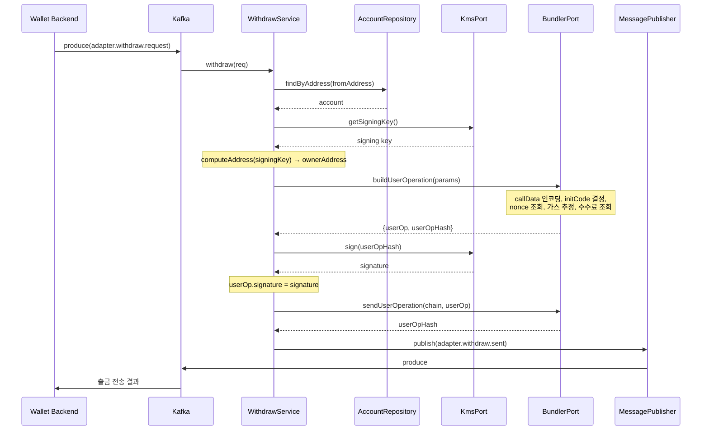

# BC Adapter 인터페이스 설계서

| 항목 | 내용 |
|------|------|
| 시스템명 | BC Adapter (Blockchain Adapter) |
| 버전 | 1.0.0 |
| 작성일 | 2026-02-24 |
| 아키텍처 | Hexagonal Architecture (Ports & Adapters) |
| 통신 프로토콜 | Apache Kafka (비동기 메시징), WebSocket (실시간 이벤트), REST API (NHN Cloud KMS) |

---

## 목차

1. [시스템 개요](#1-시스템-개요)
2. [용어 정의](#2-용어-정의)
3. [외부 인터페이스 - Kafka 메시지](#3-외부-인터페이스---kafka-메시지)
4. [외부 인터페이스 - WebSocket](#4-외부-인터페이스---websocket)
5. [외부 인터페이스 - NHN Cloud KMS REST API](#5-외부-인터페이스---nhn-cloud-kms-rest-api)
6. [내부 인터페이스 - Inbound Port](#6-내부-인터페이스---inbound-port)
7. [내부 인터페이스 - Outbound Port](#7-내부-인터페이스---outbound-port)
8. [도메인 모델](#8-도메인-모델)
9. [에러 코드 정의](#9-에러-코드-정의)
10. [응답 형식 규격](#10-응답-형식-규격)
11. [시퀀스 다이어그램](#11-시퀀스-다이어그램)
12. [연동 시스템 목록](#12-연동-시스템-목록)

---

## 1. 시스템 개요

BC Adapter는 **Wallet Backend**와 **EVM 블록체인** 사이의 어댑터 서비스입니다.

Kafka 메시지 기반의 비동기 인터페이스를 통해 다음 기능을 수행합니다:

- **계정 생성**: CREATE2를 이용한 스마트 컨트랙트 지갑 주소 도출
- **입금 감지**: WebSocket을 통한 실시간 입금 이벤트 수신 및 Kafka 발행
- **입금 확인**: 블록체인 RPC를 통한 트랜잭션 컨펌 수 조회
- **출금 처리**: ERC-4337 Account Abstraction 기반 UserOperation 생성 및 전송
- **출금 상태 확인**: UserOperation 영수증 조회

### 지원 체인

| 체인 ID | 체인명 | 설명 |
|---------|--------|------|
| `ethereum` | Ethereum Mainnet | 이더리움 메인넷 |
| `polygon` | Polygon Mainnet | 폴리곤 메인넷 |
| `sepolia` | Sepolia Testnet | 이더리움 테스트넷 |

---

## 2. 용어 정의

| 용어 | 설명 |
|------|------|
| CREATE2 | 솔리디티 opcode로, 배포 전 스마트 컨트랙트 주소를 결정적으로 계산하는 메커니즘 |
| ERC-4337 | Account Abstraction 표준. 스마트 컨트랙트 지갑에서 UserOperation으로 트랜잭션 실행 |
| UserOperation | ERC-4337에서 사용자의 의도를 담은 구조체. Bundler에 제출하여 온체인 실행 |
| Bundler | UserOperation을 수집하여 하나의 트랜잭션으로 번들링해 블록체인에 제출하는 서비스 |
| EntryPoint | ERC-4337의 핵심 싱글톤 컨트랙트. UserOperation을 검증하고 실행 |
| KMS | Key Management Service. 서명 키를 안전하게 관리하는 외부 서비스 (NHN Cloud KMS) |
| salt | CREATE2 주소 도출 시 사용되는 유일한 파생 매개변수 |
| requestId | 요청-응답 매칭을 위한 추적 식별자 |
| wei | 이더리움 최소 단위 (1 ETH = 10^18 wei) |
| confirmations | 트랜잭션이 포함된 블록 이후 생성된 블록 수. 높을수록 거래 확정도가 높음 |

---

## 3. 외부 인터페이스 - Kafka 메시지

### 3.1 토픽 총괄

| No | 방향 | 토픽명 | 설명 | 트리거 |
|----|------|--------|------|--------|
| 1 | Inbound (Subscribe) | `adapter.account.create` | 계정 생성 요청 | Wallet Backend |
| 2 | Outbound (Publish) | `adapter.account.created` | 계정 생성 결과 | AccountService |
| 3 | Outbound (Publish) | `adapter.deposit.detected` | 입금 감지 알림 | DepositService |
| 4 | Inbound (Subscribe) | `adapter.deposit.confirm` | 입금 컨펌 확인 요청 | Wallet Backend |
| 5 | Outbound (Publish) | `adapter.deposit.confirmed` | 입금 컨펌 결과 | DepositService |
| 6 | Inbound (Subscribe) | `adapter.withdraw.request` | 출금 요청 | Wallet Backend |
| 7 | Outbound (Publish) | `adapter.withdraw.sent` | 출금 전송 결과 | WithdrawService |
| 8 | Inbound (Subscribe) | `adapter.withdraw.status` | 출금 상태 확인 요청 | Wallet Backend |
| 9 | Outbound (Publish) | `adapter.withdraw.confirmed` | 출금 최종 결과 | WithdrawService |

### Kafka 설정

| 항목 | 값 | 환경변수 |
|------|-----|---------|
| Client ID | `bc-adapter` | `KAFKA_CLIENT_ID` |
| Group ID | `bc-adapter-group` | `KAFKA_GROUP_ID` |
| Brokers | 쉼표 구분 | `KAFKA_BROKERS` |
| Consumer offset | `fromBeginning: false` | - |

---

### 3.2 IF-01: 계정 생성

#### 요청 - `adapter.account.create` (Inbound)

| 필드 | 타입 | 필수 | 설명 | 예시 |
|------|------|------|------|------|
| requestId | string | O | 요청 추적 ID | `"req-001"` |
| chain | string | O | 블록체인 네트워크 | `"sepolia"` |
| salt | string | O | 지갑 주소 유도용 salt | `"user-wallet-001"` |

```json
{
  "requestId": "req-001",
  "chain": "sepolia",
  "salt": "user-wallet-001"
}
```

#### 응답 - `adapter.account.created` (Outbound)

**성공:**

| 필드 | 타입 | 설명 |
|------|------|------|
| requestId | string | 요청 추적 ID |
| address | string | 생성(도출)된 스마트 컨트랙트 지갑 주소 |
| chain | string | 블록체인 네트워크 |
| salt | string | 사용된 salt |

```json
{
  "requestId": "req-001",
  "address": "0x1234567890abcdef1234567890abcdef12345678",
  "chain": "sepolia",
  "salt": "user-wallet-001"
}
```

**실패:**

| 필드 | 타입 | 설명 |
|------|------|------|
| requestId | string | 요청 추적 ID |
| error | string | 에러 메시지 |
| errorCode | string | 에러 코드 ([9. 에러 코드 정의](#9-에러-코드-정의) 참조) |

```json
{
  "requestId": "req-001",
  "error": "Missing required fields: chain",
  "errorCode": "MISSING_REQUIRED_FIELDS"
}
```

**비고:**
- 동일한 `salt`로 재요청 시 기존 주소를 반환합니다 (멱등성 보장).
- 주소는 CREATE2 방식으로 계산되며, 실제 스마트 컨트랙트 배포는 첫 출금 시 initCode를 통해 수행됩니다.

---

### 3.3 IF-02: 입금 감지 알림

#### 발행 - `adapter.deposit.detected` (Outbound)

입금 감지는 WebSocket으로 수신된 이벤트를 기반으로 발행됩니다 (별도의 Inbound Kafka 토픽 없음).

| 필드 | 타입 | 설명 |
|------|------|------|
| txHash | string | 트랜잭션 해시 |
| address | string | 입금이 감지된 지갑 주소 |
| amount | string | 입금 금액 (wei 단위) |
| chain | string | 블록체인 네트워크 |

```json
{
  "txHash": "0xabc123def456789012345678901234567890abcdef1234567890abcdef123456",
  "address": "0x1234567890abcdef1234567890abcdef12345678",
  "amount": "1000000000000000000",
  "chain": "sepolia"
}
```

**비고:**
- 등록되지 않은 주소로의 입금은 무시됩니다 (로그만 기록).
- `amount`는 항상 wei 단위 문자열입니다.

---

### 3.4 IF-03: 입금 컨펌 확인

#### 요청 - `adapter.deposit.confirm` (Inbound)

| 필드 | 타입 | 필수 | 설명 | 예시 |
|------|------|------|------|------|
| requestId | string | O | 요청 추적 ID | `"req-002"` |
| txHash | string | O | 확인할 트랜잭션 해시 | `"0xabc...123"` |
| chain | string | O | 블록체인 네트워크 | `"sepolia"` |

```json
{
  "requestId": "req-002",
  "txHash": "0xabc123def456789012345678901234567890abcdef1234567890abcdef123456",
  "chain": "sepolia"
}
```

#### 응답 - `adapter.deposit.confirmed` (Outbound)

**성공 (confirmed/pending):**

| 필드 | 타입 | 설명 |
|------|------|------|
| requestId | string | 요청 추적 ID |
| txHash | string | 트랜잭션 해시 |
| status | string | `"confirmed"` \| `"pending"` \| `"failed"` |
| confirmations | number | 현재 컨펌 수 |
| required | number | 필요 컨펌 수 (기본값: 12) |

```json
{
  "requestId": "req-002",
  "txHash": "0xabc123...123456",
  "status": "confirmed",
  "confirmations": 15,
  "required": 12
}
```

**실패:**

| 필드 | 타입 | 설명 |
|------|------|------|
| requestId | string | 요청 추적 ID |
| txHash | string | 트랜잭션 해시 |
| status | string | `"failed"` (고정) |
| error | string | 에러 메시지 |
| errorCode | string | 에러 코드 |

```json
{
  "requestId": "req-002",
  "txHash": "0xabc123...123456",
  "status": "failed",
  "error": "RPC connection failed",
  "errorCode": "RPC_CONNECTION_FAILED"
}
```

**비고:**
- `status`가 `"pending"`이면 아직 필요 컨펌 수에 도달하지 않은 상태입니다.
- `status`가 `"failed"`이면 트랜잭션이 온체인에서 revert된 경우입니다.
- 필요 컨펌 수는 환경변수 `REQUIRED_CONFIRMATIONS`로 설정합니다 (기본값: 12).

---

### 3.5 IF-04: 출금 요청

#### 요청 - `adapter.withdraw.request` (Inbound)

| 필드 | 타입 | 필수 | 설명 | 예시 |
|------|------|------|------|------|
| requestId | string | O | 요청 추적 ID | `"req-003"` |
| chain | string | O | 블록체인 네트워크 | `"sepolia"` |
| fromAddress | string | O | 출금 지갑 주소 (스마트 컨트랙트) | `"0x1234...abcd"` |
| toAddress | string | O | 수신 주소 | `"0x5678...efgh"` |
| amount | string | O | 출금 금액 (wei) | `"1000000000000000000"` |
| token | string | O | `"ETH"` 또는 ERC-20 컨트랙트 주소 | `"ETH"` |

```json
{
  "requestId": "req-003",
  "chain": "sepolia",
  "fromAddress": "0x1234567890abcdef1234567890abcdef12345678",
  "toAddress": "0xabcdef1234567890abcdef1234567890abcdef12",
  "amount": "1000000000000000000",
  "token": "ETH"
}
```

ERC-20 토큰 전송 예시:

```json
{
  "requestId": "req-004",
  "chain": "sepolia",
  "fromAddress": "0x1234567890abcdef1234567890abcdef12345678",
  "toAddress": "0xabcdef1234567890abcdef1234567890abcdef12",
  "amount": "5000000",
  "token": "0xA0b86a33E6417C50c5B1e5D8d1d4f8a2c4e4a5b6"
}
```

#### 응답 - `adapter.withdraw.sent` (Outbound)

**성공:**

| 필드 | 타입 | 설명 |
|------|------|------|
| requestId | string | 요청 추적 ID |
| chain | string | 블록체인 네트워크 |
| fromAddress | string | 출금 지갑 주소 |
| toAddress | string | 수신 주소 |
| amount | string | 출금 금액 (wei) |
| token | string | 토큰 종류 |
| userOpHash | string | UserOperation 해시 (상태 확인용) |

```json
{
  "requestId": "req-003",
  "chain": "sepolia",
  "fromAddress": "0x1234...abcd",
  "toAddress": "0xabcd...ef12",
  "amount": "1000000000000000000",
  "token": "ETH",
  "userOpHash": "0xdef456789012345678901234567890abcdef1234567890abcdef1234567890ab"
}
```

**실패:**

```json
{
  "requestId": "req-003",
  "error": "Account not found: 0x1234...abcd",
  "errorCode": "ACCOUNT_NOT_FOUND"
}
```

**비고:**
- `fromAddress`는 사전에 계정 생성(IF-01)을 통해 등록되어 있어야 합니다.
- `token`이 `"ETH"`이면 네이티브 ETH 전송, 그 외에는 해당 주소의 ERC-20 `transfer()` 호출입니다.
- 스마트 컨트랙트 미배포 상태일 경우 첫 출금 시 `initCode`를 통해 자동 배포됩니다.
- 응답의 `userOpHash`는 후속 상태 확인(IF-05)에 사용합니다.

---

### 3.6 IF-05: 출금 상태 확인

#### 요청 - `adapter.withdraw.status` (Inbound)

| 필드 | 타입 | 필수 | 설명 | 예시 |
|------|------|------|------|------|
| requestId | string | O | 요청 추적 ID | `"req-005"` |
| chain | string | O | 블록체인 네트워크 | `"sepolia"` |
| userOpHash | string | O | 확인할 UserOperation 해시 | `"0xdef...456"` |

```json
{
  "requestId": "req-005",
  "chain": "sepolia",
  "userOpHash": "0xdef456789012345678901234567890abcdef1234567890abcdef1234567890ab"
}
```

#### 응답 - `adapter.withdraw.confirmed` (Outbound)

**처리 중 (pending):**

| 필드 | 타입 | 설명 |
|------|------|------|
| requestId | string | 요청 추적 ID |
| userOpHash | string | UserOperation 해시 |
| status | string | `"pending"` |

```json
{
  "requestId": "req-005",
  "userOpHash": "0xdef456...7890ab",
  "status": "pending"
}
```

**성공 (success):**

| 필드 | 타입 | 설명 |
|------|------|------|
| requestId | string | 요청 추적 ID |
| userOpHash | string | UserOperation 해시 |
| success | boolean | 성공 여부 (`true`) |
| txHash | string | 온체인 트랜잭션 해시 |
| actualGasCost | string | 실제 가스 비용 (wei) |
| actualGasUsed | string | 실제 가스 사용량 |

```json
{
  "requestId": "req-005",
  "userOpHash": "0xdef456...7890ab",
  "success": true,
  "txHash": "0x789012345678901234567890abcdef1234567890abcdef1234567890abcdef12",
  "actualGasCost": "21000000000000",
  "actualGasUsed": "21000"
}
```

**실패 (failed):**

| 필드 | 타입 | 설명 |
|------|------|------|
| requestId | string | 요청 추적 ID |
| userOpHash | string | UserOperation 해시 |
| status | string | `"failed"` (고정) |
| error | string | 에러 메시지 |
| errorCode | string | 에러 코드 |

```json
{
  "requestId": "req-005",
  "userOpHash": "0xdef456...7890ab",
  "status": "failed",
  "error": "Bundler receipt retrieval failed",
  "errorCode": "BUNDLER_RECEIPT_FAILED"
}
```

**비고:**
- `status`가 `"pending"`이면 아직 Bundler가 트랜잭션을 처리 중입니다. 일정 시간 후 재요청이 필요합니다.
- `success`가 `true`이면 온체인에서 UserOperation이 성공적으로 실행된 상태입니다.

---

## 4. 외부 인터페이스 - WebSocket

### 4.1 IF-WS-01: 입금 이벤트 수신

WebSocket 서버로 Deposit Listener(별도 서비스)가 연결하여 입금 이벤트를 전달합니다.

| 항목 | 값 |
|------|-----|
| 프로토콜 | WebSocket (ws://) |
| 포트 | `WS_PORT` (기본값: 8080) |
| 방향 | Deposit Listener → BC Adapter |
| 용도 | 블록체인 입금 이벤트 실시간 수신 |

#### 연결 흐름

```
Deposit Listener → ws://bc-adapter:{WS_PORT} 연결
                 → 입금 감지 시 JSON 메시지 전송
                 → BC Adapter가 등록 주소 확인 후 Kafka 발행
```

#### 메시지 형식

| 필드 | 타입 | 필수 | 설명 | 예시 |
|------|------|------|------|------|
| txHash | string | O | 트랜잭션 해시 | `"0xabc...123"` |
| toAddress | string | O | 입금 대상 주소 | `"0x1234...abcd"` |
| amount | string | O | 입금 금액 (wei) | `"1000000000000000000"` |
| chain | string | O | 블록체인 네트워크 | `"sepolia"` |

```json
{
  "txHash": "0xabc123def456789012345678901234567890abcdef1234567890abcdef123456",
  "toAddress": "0x1234567890abcdef1234567890abcdef12345678",
  "amount": "1000000000000000000",
  "chain": "sepolia"
}
```

#### 처리 규칙

| 조건 | 동작 |
|------|------|
| `toAddress`가 등록된 주소 | `adapter.deposit.detected` 토픽으로 Kafka 발행 |
| `toAddress`가 미등록 주소 | 로그 기록 후 무시 |
| JSON 파싱 실패 | 에러 로그 기록, 연결 유지 |

---

## 5. 외부 인터페이스 - NHN Cloud KMS REST API

BC Adapter는 NHN Cloud KMS와 REST API로 통신하여 서명 키 조회 및 데이터 서명을 수행합니다.

| 항목 | 내용 |
|------|------|
| 프로토콜 | HTTPS (REST API) |
| Base URL | `NHN_KMS_ENDPOINT` 환경변수 |
| API 버전 | v1.2 |
| 구현체 | `NhnKmsAdapter` (`src/adapter/out/kms/NhnKmsAdapter.ts`) |
| HTTP 클라이언트 | axios |

### 공통 요청 헤더

| 헤더 | 값 | 설명 |
|------|-----|------|
| `X-TC-APP-KEY` | `NHN_KMS_APP_KEY` | NHN Cloud 앱 키 |
| `X-TC-AUTHENTICATION-ID` | `NHN_KMS_SECRET_KEY` | NHN Cloud 인증 시크릿 |
| `Content-Type` | `application/json` | 요청 본문 형식 |

### 환경변수

| 환경변수 | 필수 | 설명 |
|---------|------|------|
| `NHN_KMS_ENDPOINT` | O | KMS API Base URL |
| `NHN_KMS_APP_KEY` | O | NHN Cloud 앱 키 |
| `NHN_KMS_SECRET_KEY` | O | NHN Cloud 인증 시크릿 |
| `NHN_KMS_KEY_ID` | O | 사용할 키/시크릿 ID |
| `USE_MOCK_KMS` | - | `"true"` 시 MockKmsAdapter 사용 (KMS 미호출) |

---

### 5.1 IF-KMS-01: 서명 키 조회

계정 생성 및 출금 시 서명용 개인키를 조회합니다.

| 항목 | 내용 |
|------|------|
| Method | `GET` |
| Path | `/keymanager/v1.2/appkey/{appKey}/secrets/{keyId}` |
| 호출 시점 | AccountService.createAccount(), WithdrawService.withdraw() |

#### 요청

| Path Parameter | 타입 | 설명 |
|----------------|------|------|
| appKey | string | NHN Cloud 앱 키 (`NHN_KMS_APP_KEY`) |
| keyId | string | 시크릿 ID (`NHN_KMS_KEY_ID`) |

```
GET {endpoint}/keymanager/v1.2/appkey/{appKey}/secrets/{keyId}
```

#### 응답

**성공 (200):**

```json
{
  "header": { ... },
  "body": {
    "secret": "0x개인키문자열..."
  }
}
```

| 필드 | 타입 | 설명 |
|------|------|------|
| body.secret | string | 서명용 개인키 |

**실패 시 에러 처리:**

| 조건 | 에러 코드 | 에러 클래스 |
|------|-----------|-----------|
| `res.data.body.secret` 없음 | `KMS_KEY_RETRIEVAL_FAILED` | `InfrastructureError` |
| HTTP 오류 (네트워크 등) | `KMS_KEY_RETRIEVAL_FAILED` | `InfrastructureError` |

---

### 5.2 IF-KMS-02: 데이터 서명

출금 시 UserOperation 해시에 대한 서명을 생성합니다.

| 항목 | 내용 |
|------|------|
| Method | `POST` |
| Path | `/keymanager/v1.2/appkey/{appKey}/keys/{keyId}/sign` |
| 호출 시점 | WithdrawService.withdraw() |

#### 요청

| Path Parameter | 타입 | 설명 |
|----------------|------|------|
| appKey | string | NHN Cloud 앱 키 (`NHN_KMS_APP_KEY`) |
| keyId | string | 키 ID (`NHN_KMS_KEY_ID`) |

**Request Body:**

| 필드 | 타입 | 필수 | 설명 |
|------|------|------|------|
| data | string | O | 서명 대상 데이터 (UserOperation 해시) |

```json
{
  "data": "0xuserOpHash..."
}
```

#### 응답

**성공 (200):**

```json
{
  "header": { ... },
  "body": {
    "signature": "0x서명문자열..."
  }
}
```

| 필드 | 타입 | 설명 |
|------|------|------|
| body.signature | string | 생성된 서명 |

**실패 시 에러 처리:**

| 조건 | 에러 코드 | 에러 클래스 |
|------|-----------|-----------|
| `res.data.body.signature` 없음 | `KMS_SIGNING_FAILED` | `InfrastructureError` |
| HTTP 오류 (네트워크 등) | `KMS_SIGNING_FAILED` | `InfrastructureError` |

---

### 5.3 개발 환경 (MockKmsAdapter)

`USE_MOCK_KMS=true` 설정 시 NHN Cloud KMS를 호출하지 않고 로컬에서 키를 생성합니다.

| 항목 | 내용 |
|------|------|
| 구현체 | `MockKmsAdapter` (`src/adapter/out/kms/MockKmsAdapter.ts`) |
| 키 생성 | `MOCK_KMS_PRIVATE_KEY` 환경변수 또는 `ethers.Wallet.createRandom()` |
| 서명 | `ethers.SigningKey.sign()` 로컬 서명 |

---

## 6. 내부 인터페이스 - Inbound Port

Inbound Port는 외부 어댑터(Kafka Consumer, WebSocket)가 호출하는 유스케이스 인터페이스입니다.

### 6.1 CreateAccountUseCase

| 항목 | 내용 |
|------|------|
| 파일 | `src/domain/port/in/CreateAccountUseCase.ts` |
| 구현체 | `AccountService` |
| 호출자 | `KafkaConsumerAdapter` |

```typescript
interface CreateAccountRequest {
  requestId: string;
  chain: string;
  salt: string;
}

interface CreateAccountUseCase {
  createAccount(req: CreateAccountRequest): Promise<void>;
}
```

| 메서드 | 파라미터 | 반환 | 설명 |
|--------|---------|------|------|
| `createAccount` | `CreateAccountRequest` | `Promise<void>` | CREATE2 주소 도출 후 저장 및 결과 발행 |

---

### 6.2 HandleDepositUseCase

| 항목 | 내용 |
|------|------|
| 파일 | `src/domain/port/in/HandleDepositUseCase.ts` |
| 구현체 | `DepositService` |
| 호출자 | `WebSocketAdapter` |

```typescript
interface DepositEvent {
  txHash: string;
  toAddress: string;
  amount: string;
  chain: string;
}

interface HandleDepositUseCase {
  handleDeposit(event: DepositEvent): Promise<void>;
}
```

| 메서드 | 파라미터 | 반환 | 설명 |
|--------|---------|------|------|
| `handleDeposit` | `DepositEvent` | `Promise<void>` | 등록 주소 확인 후 입금 감지 이벤트 발행 |

---

### 6.3 CheckConfirmUseCase

| 항목 | 내용 |
|------|------|
| 파일 | `src/domain/port/in/CheckConfirmUseCase.ts` |
| 구현체 | `DepositService` |
| 호출자 | `KafkaConsumerAdapter` |

```typescript
interface CheckConfirmRequest {
  requestId: string;
  txHash: string;
  chain: string;
}

interface CheckConfirmUseCase {
  checkConfirm(req: CheckConfirmRequest): Promise<void>;
}
```

| 메서드 | 파라미터 | 반환 | 설명 |
|--------|---------|------|------|
| `checkConfirm` | `CheckConfirmRequest` | `Promise<void>` | 트랜잭션 컨펌 수 조회 후 결과 발행 |

---

### 6.4 WithdrawUseCase

| 항목 | 내용 |
|------|------|
| 파일 | `src/domain/port/in/WithdrawUseCase.ts` |
| 구현체 | `WithdrawService` |
| 호출자 | `KafkaConsumerAdapter` |

```typescript
interface WithdrawRequest {
  requestId: string;
  chain: string;
  fromAddress: string;
  toAddress: string;
  amount: string;
  token: string;        // "ETH" 또는 ERC-20 컨트랙트 주소
}

interface CheckWithdrawStatusRequest {
  requestId: string;
  chain: string;
  userOpHash: string;
}

interface WithdrawUseCase {
  withdraw(req: WithdrawRequest): Promise<void>;
  checkStatus(req: CheckWithdrawStatusRequest): Promise<void>;
}
```

| 메서드 | 파라미터 | 반환 | 설명 |
|--------|---------|------|------|
| `withdraw` | `WithdrawRequest` | `Promise<void>` | UserOperation 생성, 서명, 전송 후 결과 발행 |
| `checkStatus` | `CheckWithdrawStatusRequest` | `Promise<void>` | UserOperation 영수증 조회 후 결과 발행 |

---

## 7. 내부 인터페이스 - Outbound Port

Outbound Port는 애플리케이션 서비스가 외부 시스템에 접근할 때 사용하는 인터페이스입니다.

### 7.1 AccountRepository

| 항목 | 내용 |
|------|------|
| 파일 | `src/domain/port/out/AccountRepository.ts` |
| 구현체 | `TypeOrmAccountRepository` |
| 연동 시스템 | PostgreSQL |

```typescript
interface AccountRepository {
  save(account: Account): Promise<Account>;
  findByAddress(address: string): Promise<Account | null>;
  findBySalt(salt: string): Promise<Account | null>;
}
```

| 메서드 | 파라미터 | 반환 | 설명 |
|--------|---------|------|------|
| `save` | `Account` | `Promise<Account>` | 계정 정보 저장 |
| `findByAddress` | `address: string` | `Promise<Account \| null>` | 주소로 계정 조회 |
| `findBySalt` | `salt: string` | `Promise<Account \| null>` | salt로 계정 조회 (중복 검증) |

---

### 7.2 BlockchainPort

| 항목 | 내용 |
|------|------|
| 파일 | `src/domain/port/out/BlockchainPort.ts` |
| 구현체 | `EthersBlockchainAdapter` |
| 연동 시스템 | EVM RPC Node |

```typescript
type ConfirmStatus = "pending" | "confirmed" | "failed";

interface ConfirmResult {
  txHash: string;
  status: ConfirmStatus;
  confirmations: number;
  required: number;
}

interface BlockchainPort {
  computeAddress(salt: string): string;
  checkConfirmations(chain: string, txHash: string): Promise<ConfirmResult>;
}
```

| 메서드 | 파라미터 | 반환 | 설명 |
|--------|---------|------|------|
| `computeAddress` | `salt: string` | `string` | CREATE2로 스마트 컨트랙트 주소 계산 |
| `checkConfirmations` | `chain, txHash` | `Promise<ConfirmResult>` | 트랜잭션 컨펌 수 및 상태 조회 |

**ConfirmResult 상태 매핑:**

| 조건 | status | confirmations |
|------|--------|---------------|
| 트랜잭션 영수증 없음 | `"pending"` | 0 |
| 영수증 status === 0 (revert) | `"failed"` | 0 |
| 컨펌 수 < 필요 수 | `"pending"` | 실제 컨펌 수 |
| 컨펌 수 >= 필요 수 | `"confirmed"` | 실제 컨펌 수 |

---

### 7.3 BundlerPort

| 항목 | 내용 |
|------|------|
| 파일 | `src/domain/port/out/BundlerPort.ts` |
| 구현체 | `ERC4337BundlerAdapter` |
| 연동 시스템 | ERC-4337 Bundler Service, EVM RPC Node |

```typescript
interface UserOperationReceipt {
  userOpHash: string;
  success: boolean;
  actualGasCost: string;
  actualGasUsed: string;
  txHash: string;
}

interface BundlerPort {
  buildUserOperation(params: {
    chain: string;
    sender: string;
    toAddress: string;
    amount: string;
    token: string;
    ownerAddress: string;
    salt: string;
  }): Promise<{ userOp: UserOperation; userOpHash: string }>;

  sendUserOperation(chain: string, userOp: UserOperation): Promise<string>;

  getUserOperationReceipt(
    chain: string,
    userOpHash: string,
  ): Promise<UserOperationReceipt | null>;
}
```

| 메서드 | 파라미터 | 반환 | 설명 |
|--------|---------|------|------|
| `buildUserOperation` | 체인, 주소, 금액 등 | `Promise<{ userOp, userOpHash }>` | UserOperation 빌드 (가스 추정, nonce 조회 포함) |
| `sendUserOperation` | `chain, userOp` | `Promise<string>` | Bundler에 서명된 UserOp 전송. userOpHash 반환 |
| `getUserOperationReceipt` | `chain, userOpHash` | `Promise<Receipt \| null>` | UserOp 실행 영수증 조회. 미처리 시 null |

**buildUserOperation 처리 흐름:**

1. `token`에 따라 callData 인코딩 (ETH 전송 또는 ERC-20 transfer)
2. `getCode(sender)`로 스마트 컨트랙트 배포 여부 확인
3. 미배포 시 `initCode` 생성 (factory + createAccount)
4. `EntryPoint.getNonce(sender, 0)`로 nonce 조회
5. `eth_estimateUserOperationGas`로 가스 추정
6. `getFeeData()`로 가스 가격 조회
7. `userOpHash` 계산 (keccak256 패킹)

---

### 7.4 KmsPort

| 항목 | 내용 |
|------|------|
| 파일 | `src/domain/port/out/KmsPort.ts` |
| 구현체 | `MockKmsAdapter` (개발), `NhnKmsAdapter` (운영) |
| 연동 시스템 | NHN Cloud KMS (운영), 로컬 키 (개발) |
| REST API 상세 | [5. 외부 인터페이스 - NHN Cloud KMS REST API](#5-외부-인터페이스---nhn-cloud-kms-rest-api) 참조 |

```typescript
interface KmsPort {
  getSigningKey(): Promise<string>;
  sign(data: string): Promise<string>;
}
```

| 메서드 | 파라미터 | 반환 | 설명 |
|--------|---------|------|------|
| `getSigningKey` | - | `Promise<string>` | 서명용 키(개인키) 조회 |
| `sign` | `data: string` | `Promise<string>` | 데이터에 대한 서명 생성 |

**구현체 선택:**

| 환경변수 | 값 | 사용 구현체 |
|---------|-----|-----------|
| `USE_MOCK_KMS` | `"true"` | `MockKmsAdapter` (로컬 랜덤 키 또는 `MOCK_KMS_PRIVATE_KEY`) |
| `USE_MOCK_KMS` | 그 외 | `NhnKmsAdapter` (NHN Cloud KMS API 호출) |

---

### 7.5 MessagePublisher

| 항목 | 내용 |
|------|------|
| 파일 | `src/domain/port/out/MessagePublisher.ts` |
| 구현체 | `KafkaProducerAdapter` |
| 연동 시스템 | Apache Kafka |

```typescript
interface MessagePublisher {
  publish(topic: string, payload: Record<string, unknown>): Promise<void>;
}
```

| 메서드 | 파라미터 | 반환 | 설명 |
|--------|---------|------|------|
| `publish` | `topic, payload` | `Promise<void>` | JSON 메시지를 지정 토픽에 발행 |

---

## 8. 도메인 모델

### 8.1 Account

| 항목 | 내용 |
|------|------|
| 파일 | `src/domain/model/Account.ts` |
| 저장소 | PostgreSQL (`account_entity` 테이블) |

| 필드 | 타입 | 필수 | DB 제약 | 설명 |
|------|------|------|---------|------|
| id | number | 자동 | PK, Auto Increment | 고유 식별자 |
| address | string | O | Unique Index | 스마트 컨트랙트 지갑 주소 |
| chain | string | O | - | 블록체인 네트워크 |
| salt | string | O | - | CREATE2 파생 매개변수 |
| createdAt | Date | 자동 | Auto Generate | 생성 일시 |

### 8.2 UserOperation

| 항목 | 내용 |
|------|------|
| 파일 | `src/domain/model/UserOperation.ts` |
| 표준 | ERC-4337 v0.7 |

| 필드 | 타입 | 설명 |
|------|------|------|
| sender | string | 스마트 컨트랙트 계정 주소 |
| nonce | string | 계정 nonce |
| callData | string | 인코딩된 함수 호출 데이터 |
| callGasLimit | string | 실행 가스 한도 |
| verificationGasLimit | string | 검증 가스 한도 |
| preVerificationGas | string | 사전 검증 가스 |
| maxFeePerGas | string | 최대 가스 수수료 |
| maxPriorityFeePerGas | string | 최대 우선순위 수수료 |
| signature | string | 서명 |
| initCode | string | 계정 배포 코드 (배포 완료 시 `"0x"`) |
| paymasterAndData | string | Paymaster 데이터 |

---

## 9. 에러 코드 정의

| 카테고리 | 에러 코드 | 설명 | HTTP 유사 |
|----------|-----------|------|-----------|
| **Validation** | `VALIDATION_ERROR` | 일반 유효성 검증 실패 | 400 |
| | `MISSING_REQUIRED_FIELDS` | 필수 필드 누락 | 400 |
| | `UNSUPPORTED_CHAIN` | 지원하지 않는 체인 | 400 |
| **Not Found** | `NOT_FOUND` | 일반 리소스 미발견 | 404 |
| | `ACCOUNT_NOT_FOUND` | 계정 미등록 (출금 시) | 404 |
| **Infrastructure - KMS** | `KMS_KEY_RETRIEVAL_FAILED` | KMS 키 조회 실패 | 502 |
| | `KMS_SIGNING_FAILED` | KMS 서명 실패 | 502 |
| **Infrastructure - RPC** | `RPC_CONNECTION_FAILED` | 블록체인 RPC 연결 실패 | 502 |
| | `RPC_NOT_CONFIGURED` | 체인의 RPC URL 미설정 | 500 |
| **Infrastructure - Bundler** | `BUNDLER_BUILD_FAILED` | UserOperation 빌드 실패 | 502 |
| | `BUNDLER_SEND_FAILED` | UserOperation 전송 실패 | 502 |
| | `BUNDLER_RECEIPT_FAILED` | UserOperation 영수증 조회 실패 | 502 |
| | `BUNDLER_NOT_CONFIGURED` | 체인의 Bundler URL 미설정 | 500 |
| **Infrastructure - DB** | `DB_SAVE_FAILED` | 데이터베이스 저장 실패 | 500 |
| | `DB_QUERY_FAILED` | 데이터베이스 조회 실패 | 500 |
| **Business** | `BUSINESS_ERROR` | 비즈니스 로직 에러 | 422 |
| **Unknown** | `UNKNOWN_ERROR` | 분류 불가 에러 | 500 |

### 에러 클래스 계층

```
AppError (base)
├── ValidationError      → VALIDATION_ERROR, MISSING_REQUIRED_FIELDS, UNSUPPORTED_CHAIN
├── NotFoundError         → NOT_FOUND, ACCOUNT_NOT_FOUND
├── BusinessError         → BUSINESS_ERROR
└── InfrastructureError   → KMS_*, RPC_*, BUNDLER_*, DB_*
```

---

## 10. 응답 형식 규격

모든 Kafka 응답 메시지는 아래 규격을 따릅니다.

### 성공 응답

```typescript
{
  requestId: string,       // 원본 요청의 requestId
  ...data                  // 인터페이스별 응답 데이터
}
```

### 실패 응답

```typescript
{
  requestId: string,       // 원본 요청의 requestId
  error: string,           // 에러 메시지
  errorCode: string,       // 에러 코드 (9. 에러 코드 정의 참조)
  ...extra                 // 인터페이스별 추가 컨텍스트 (선택)
}
```

**인터페이스별 추가 컨텍스트:**

| 인터페이스 | 추가 필드 |
|-----------|----------|
| IF-03 입금 컨펌 | `txHash`, `status: "failed"` |
| IF-05 출금 상태 | `userOpHash`, `status: "failed"` |

### 입력 검증

모든 Inbound Kafka 메시지는 처리 전 `requireFields()` 함수를 통해 필수 필드를 검증합니다.

| 검증 조건 | 동작 |
|----------|------|
| 값이 `undefined` | `ValidationError` 발생 |
| 값이 `null` | `ValidationError` 발생 |
| 값이 `""` (빈 문자열) | `ValidationError` 발생 |

---

## 11. 시퀀스 다이어그램

### 11.1 계정 생성 흐름


### 11.2 입금 감지 흐름


### 11.3 입금 컨펌 확인 흐름


### 11.4 출금 처리 흐름



### 11.5 출금 상태 확인 흐름


---

## 12. 연동 시스템 목록

| No | 시스템 | 프로토콜 | 용도 | 환경변수 |
|----|--------|---------|------|---------|
| 1 | **Apache Kafka** | TCP | 비동기 메시지 송수신 | `KAFKA_BROKERS` |
| 2 | **PostgreSQL** | TCP | 계정 정보 영속화 | `DB_HOST`, `DB_PORT`, `DB_DATABASE` |
| 3 | **EVM RPC Node** | JSON-RPC/HTTPS | 블록체인 조회 (CREATE2, 컨펌, nonce 등) | `ETH_RPC_URL`, `POLYGON_RPC_URL`, `SEPOLIA_RPC_URL` |
| 4 | **ERC-4337 Bundler** | JSON-RPC/HTTPS | UserOperation 가스 추정, 전송, 영수증 조회 | `ETH_BUNDLER_URL`, `POLYGON_BUNDLER_URL`, `SEPOLIA_BUNDLER_URL` |
| 5 | **NHN Cloud KMS** | REST/HTTPS | 서명 키 조회 및 서명 생성 | `NHN_KMS_APP_KEY`, `NHN_KMS_SECRET_KEY`, `NHN_KMS_KEY_ID`, `NHN_KMS_ENDPOINT` |
| 6 | **Deposit Listener** | WebSocket | 입금 이벤트 실시간 수신 | `WS_PORT` |
| 7 | **Wallet Backend** | Kafka | 요청 발행 및 결과 수신 (호출자) | - |

### 스마트 컨트랙트 주소

| 컨트랙트 | 환경변수 | 설명 |
|----------|---------|------|
| CREATE2 Factory | `CREATE2_FACTORY_ADDRESS` | CREATE2 주소 계산용 팩토리 |
| Init Code Hash | `CREATE2_INIT_CODE_HASH` | 스마트 컨트랙트 초기화 코드 해시 |
| EntryPoint | `ENTRY_POINT_ADDRESS` | ERC-4337 EntryPoint 컨트랙트 |
| Account Factory | `ACCOUNT_FACTORY_ADDRESS` | 스마트 컨트랙트 계정 팩토리 |
